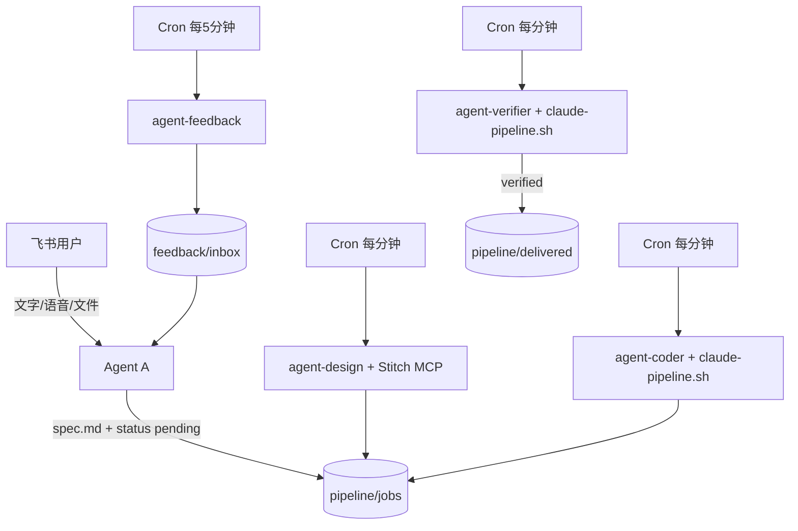

# OpenClaw 飞书多 Agent 流水线

基于 [OpenClaw](https://docs.openclaw.ai/) 的端到端系统：飞书对话 → 需求 MD → Cron 流水线（Stitch 设计 / Claude Code 实现与验证 / 反馈闭环）。

## 架构



| Agent | 职责 | 触发 |
|-------|------|------|
| **agent-a** | Brainstorming 需求分析、写 `spec.md`、汇总反馈 | 飞书消息 + Cron 读 inbox |
| **agent-design** | Google Stitch 设计 | Cron `* * * * *` |
| **agent-coder** | Claude Code 实现 | Cron `* * * * *` |
| **agent-verifier** | Claude Code 验证 | Cron `* * * * *` |
| **agent-feedback** | 生成功能/缺陷/投诉反馈 | Cron `*/5 * * * *` |

## 环境要求

- Ubuntu 22.04+
- Node.js 22+（推荐 24）
- 2GB+ RAM
- 飞书自建应用（WebSocket 长连接）
- Stitch API Key（[stitch.withgoogle.com](https://stitch.withgoogle.com) → Stitch settings → Create key，**无需 gcloud**）
- Claude Code CLI（`npm install -g @anthropic-ai/claude-code`）及 `CLAUDE_CODE_*` 凭证（见 `config/env.example`）
- LLM API Key（Anthropic / OpenAI 等，供 OpenClaw `ANTHROPIC_*`，与 Claude Code 独立）

密钥逐步获取说明见 **[docs/CREDENTIALS.md](docs/CREDENTIALS.md)**。

**OpenClaw 安装 + 飞书连接完整步骤**见 **[docs/SETUP-FEISHU.md](docs/SETUP-FEISHU.md)**（推荐先看此文）。

**改 `.env` 后重启什么、如何确认大模型已连通**见 **[env-troubleshoot.md](env-troubleshoot.md)**。

## 快速开始（Ubuntu）

```bash
cd /home/wmx/workspace/test-pipeline

# 1. 系统依赖 + OpenClaw + Claude Code
./scripts/install-ubuntu.sh

# 2. 填写密钥（含 CLAUDE_CODE_*，与 ANTHROPIC_* 分开）
nano config/.env

# 3. 认证
# config/.env 中填写 STITCH_API_KEY、CLAUDE_CODE_*（见 docs/CREDENTIALS.md）
openclaw onboard --install-daemon

# 4. 部署配置与工作区
./scripts/deploy.sh

# 5. 飞书通道 + Gateway（deploy、插件、启动）
./scripts/setup-feishu.sh
# 然后到飞书开放平台保存「长连接」并发布应用，见 docs/SETUP-FEISHU.md

# 6. 注册 Cron
./scripts/setup-cron.sh

# 7. 验证
openclaw gateway status
openclaw cron list
openclaw channels status --probe
```

## 飞书应用配置

1. 打开 [飞书开放平台](https://open.feishu.cn) → 创建企业自建应用  
2. 权限：`im:message`、`im:chat`、`contact:user.base:readonly` 等（按 OpenClaw 文档）  
3. 事件订阅：**长连接**，订阅 `im.message.receive_v1`  
4. 将 App ID / Secret 写入 `config/.env`  
5. 首次 DM：`openclaw pairing list feishu` → `openclaw pairing approve feishu <CODE>`  

详见 [OpenClaw Feishu 文档](https://docs.openclaw.ai/channels/feishu)。

## 任务目录约定

```
pipeline/jobs/<job-id>/
  spec.md          # Agent A 编写
  status.json      # 状态机
  attachments/     # 用户文件
  design/          # Stitch 产出
  src/             # Claude Code 实现
  reports/         # 实现/验证报告
```

状态：`draft`（需求分析，用户批准前）→ `pending` → `designing` → `design_done` → `implementing` → `impl_done` → `verifying` → `verified` → 复制到 `pipeline/delivered/`。

手动创建测试任务：

```bash
./scripts/new-job.sh "登录页改版"
```

## Claude Code 流水线模式

实现与验证 Agent 通过 [`scripts/claude-pipeline.sh`](scripts/claude-pipeline.sh) 调用 Claude Code 非交互模式（`claude --bare -p`）：

- 凭证：`CLAUDE_CODE_*`（见 `config/env.example`；DeepSeek 需配置 MODEL / OPUS / SONNET / HAIKU / SUBAGENT / EFFORT_LEVEL）
- 配置：`deploy.sh` 生成 `~/.claude/pipeline-settings.json`
- 实现：`claude-pipeline.sh implement`（`acceptEdits`）
- 验证：`claude-pipeline.sh verify`（只读）/ `verify-fix`（修复）

Codex CLI 为可选依赖，见 `config/codex-profiles.toml`。

## Google Stitch MCP（API Key，无需 gcloud）

1. 打开 [stitch.withgoogle.com](https://stitch.withgoogle.com) → 头像 → **Stitch settings** → **Create key**
2. 写入 `config/.env`：

```bash
export STITCH_API_KEY="你的-key"
./scripts/deploy.sh
openclaw gateway restart
```

`deploy.sh` 会配置远程 MCP `https://stitch.googleapis.com/mcp`（HTTP + `X-Goog-Api-Key`）。仅 **agent-design** 使用 Stitch。

## 运维命令

```bash
openclaw logs --follow
openclaw cron runs --id <job-id> --limit 20
openclaw gateway restart
openclaw update
```

## 目录结构

```
config/           openclaw.json5, claude/codex profile, env.example
workspaces/       各 Agent 的 AGENTS.md / SOUL.md
pipeline/         jobs, delivered, feedback
scripts/          install-ubuntu, deploy, setup-cron, new-job
docs/             补充说明
```

## 安全建议

- 在独立 VPS 运行，勿与日常办公机混用  
- 飞书 `dmPolicy: pairing` 或 `allowlist`  
- Claude Code 自动化使用 `claude-pipeline.sh`，勿在 shell 中混用 OpenClaw 的 `ANTHROPIC_*`  
- 勿将 `config/.env` 提交到 Git  

## 故障排查

详见 **[env-troubleshoot.md](env-troubleshoot.md)**（`.env` 变更重启、大模型连通性自检）。

| 现象 | 处理 |
|------|------|
| 飞书无回复 | `openclaw logs --follow`，检查应用发布与长连接 |
| Cron 不跑 | `openclaw gateway status`，`cron.enabled: true` |
| `device token scope mismatch` / `EMBEDDED FALLBACK` | [env-troubleshoot.md §2.8.1](env-troubleshoot.md#281-device-token-scope-mismatch) — `openclaw devices approve` |
| Stitch 失败 | 检查 `STITCH_API_KEY` 是否已填并 `./scripts/deploy.sh`；见 [env-troubleshoot.md §2.8.2](env-troubleshoot.md#282-stitch-mcp-启动失败) |
| Claude Code 失败 | `claude --bare -p "echo hello" --settings ~/.claude/pipeline-settings.json`；检查 `CLAUDE_CODE_*` |
| Codex 失败（可选） | `codex exec -p ci "echo test"`，检查 `~/.codex/config.toml` |

## 许可证

本仓库配置与脚本为项目交付物；OpenClaw、Claude Code、Codex、Stitch 遵循各自上游许可。
