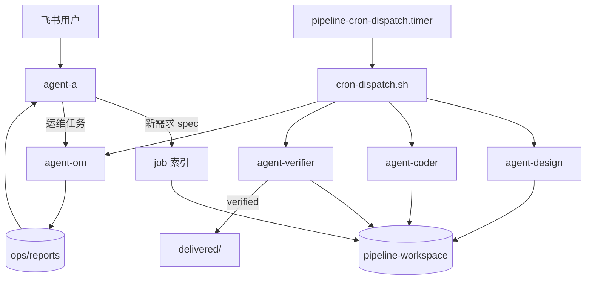

# OpenClaw 飞书多 Agent 流水线

基于 [OpenClaw](https://docs.openclaw.ai/)：飞书 → 需求 MD → Timer 驱动流水线（设计 / 实现 / 验证 / 运维 / 反馈）。

## 核心规则

| # | 规则 |
|---|------|
| 1 | 每轮迭代验证最多 **10 次**；用尽 → `verify_paused` → 用户决定是否下一轮 |
| 2 | **agent-a** 对用户；耗时运维交 **agent-om**；a 读各 Agent MD 报告汇总 |
| 3 | 本地验证用 **流水线部署机 IP**；生产在 `.env`；部署须用户指定 server |
| 4 | 所有 status 读写带 **容错**（`status-integrity.sh`） |
| 5 | **status 仅 timer + 白名单脚本** 修改；OpenClaw 禁止手改 |
| 6 | 各 Agent **职责边界** 见 `docs/AGENT-BOUNDARIES.md` |
| 7 | Bug/同需求修复 **不开新 job**；仅新需求 `new-job.sh` |
| 8 | 跳过流水线规则 **须飞书与用户确认** |

## 架构



| Agent | 职责 |
|-------|------|
| **agent-a** | 飞书入口、需求、查状态、Bug/反馈登记、下发运维 |
| **agent-om** | 部署/日志/诊断；运维 Bug → report-bug |
| **agent-design** | Stitch 设计 |
| **agent-coder** | Claude Code 实现/修复 |
| **agent-verifier** | Docker 验证 + 审查 + 交付 |
| **agent-feedback** | 交付后反馈 → inbox |

## 状态机

```
draft → pending → designing → design_done → implementing → impl_done → verifying
  → verified → delivered/
  ↘ fix_needed → implementing …（每轮最多 10 次）
  ↘ verify_paused → [用户确认] continue-verify → 下一轮 …
```

## 文档

| 文档 | 内容 |
|------|------|
| [docs/GUIDE.md](docs/GUIDE.md) | 部署指南 |
| [docs/VERIFICATION.md](docs/VERIFICATION.md) | 验证 10 轮 + verify_paused |
| [docs/PIPELINE-SCHEDULING.md](docs/PIPELINE-SCHEDULING.md) | Timer 调度（OpenClaw 勿手改 status） |
| [docs/AGENT-BOUNDARIES.md](docs/AGENT-BOUNDARIES.md) | Agent 边界 |
| [docs/BUG-FLOW.md](docs/BUG-FLOW.md) | Bug 不开新 job |
| [docs/OPS-TASKS.md](docs/OPS-TASKS.md) | agent-om 运维 |
| [docs/FEEDBACK-FLOW.md](docs/FEEDBACK-FLOW.md) | 用户反馈 |
| [docs/SECURITY.md](docs/SECURITY.md) | 安全 |

## 快速开始

```bash
cd /home/wmx/workspace/test-pipeline
./scripts/install-ubuntu.sh && cp -n config/env.example config/.env
# 填写 .env → deploy → setup-cron.sh --install-timer
```

## 关键脚本

| 脚本 | 用途 |
|------|------|
| `cron-dispatch.sh` | Timer 调度中枢 + 入口 status |
| `job-transition.sh` | 合法 status 流转 |
| `complete-verify.sh` | 验证结论 → verified/fix_needed/verify_paused |
| `continue-verify.sh` | 用户确认下一轮验证 |
| `report-bug.sh` / `reopen-job.sh` | 同 job Bug（不开新 job） |
| `om-task-create.sh` | agent-a 下发运维 |
| `detect-pipeline-host-ip.sh` | 本地验证 IP |
| `deploy-servers-list.sh` | 部署前让用户选 server |

## Cron 任务（均由 dispatch 触发，enabled=false）

`pipeline-design-scan` · `pipeline-coder-scan` · `pipeline-verify-scan` ·
`pipeline-om-scan` · `pipeline-feedback-scan` · `pipeline-a-feedback-digest` ·
`pipeline-a-verify-notify`

```bash
VERBOSE=1 DRY_RUN=1 ./scripts/cron-dispatch.sh   # 调试
```

## 目录

```
test-pipeline/          编排仓库（scripts、config、workspaces）
pipeline-workspace/     项目工作区（jobs、delivered、feedback、ops）
```

## 许可证

配置与脚本为项目交付物；上游工具遵循各自许可。
