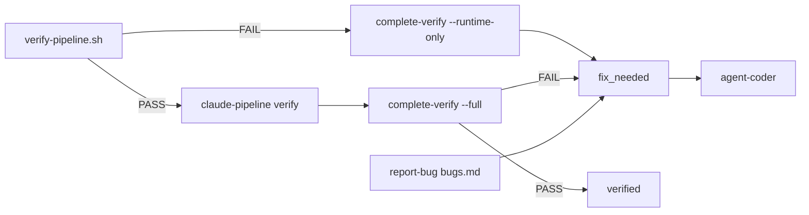
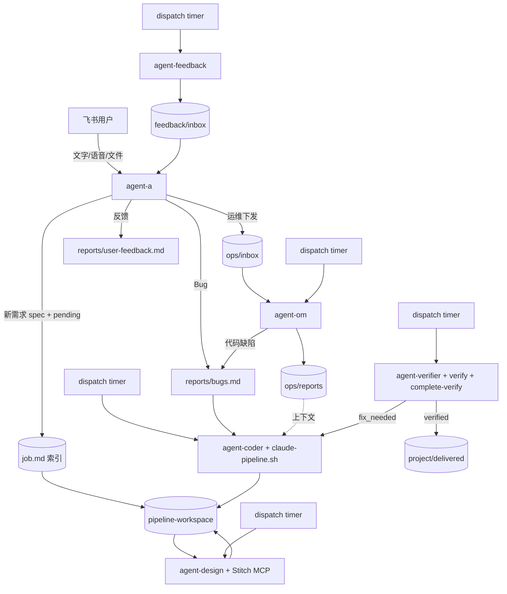

# OpenClaw 飞书多 Agent 流水线

基于 [OpenClaw](https://docs.openclaw.ai/) 的端到端系统：飞书对话 → 需求 MD → Cron 流水线（Stitch 设计 / Claude Code 实现与验证 / 反馈闭环）。

## 设计概要

近期改造的核心思路：**编排与执行分离、角色边界清晰、状态驱动调度、验证结果脚本闭环**。

| 要点 | 说明 |
|------|------|
| **双层目录** | `test-pipeline` 只存 `job.md` 索引；spec / 代码 / 报告在 `pipeline-workspace/<project>/` |
| **项目 slug** | `new-job.sh "标题"` 按 title 生成 `<project>`，并建 `jobs/`、`delivered/`、`feedback/`、`ops/` |
| **懒调度** | OpenClaw Cron 默认关闭；systemd timer → `cron-dispatch.sh` 扫 `status.json` / `ops/inbox/`，有任务才触发 |
| **验证闭环** | `verify-pipeline.sh`（Docker 部署探活）→ `claude-pipeline verify` → **`complete-verify.sh`** 自动设 status |
| **开 job 规则** | **仅用户确认的新需求** `new-job.sh`；Bug / 改已有任务在同一 job 内迭代，**禁止**为缺陷开新 job |
| **Bug vs 反馈** | **Bug** → `report-bug.sh` → `bugs.md` + `fix_needed` → coder；**反馈** → `report-feedback.sh` → `user-feedback.md` → agent-a 分拣，**不**自动进 coder |
| **运维分离** | agent-a **不下场** docker / 日志；通过 `om-task-create` 下发 MD 任务单 → **agent-om** 执行；运维发现代码缺陷同样 `report-bug.sh` → coder |
| **飞书网关** | agent-a 所有 exec 经 **`agent-a-run.sh` 白名单**；查进度用 `job-status.sh`，保证飞书响应速度 |
| **脚本门禁** | `PIPELINE_BOUNDARY_STRICT=1` 时关键脚本校验 `PIPELINE_AGENT`，防 Agent 越界 |
| **失败回流** | 默认自动 **10 轮**；超限 → `verify_paused` + **飞书主动推送**，用户决定 `continue-verify.sh` |
| **里程碑推送** | `feishu-notify-scan.sh` + 脚本钩子：`pending` / `design_done` / `impl_done` / `verified` / `verify_paused` / `delivered` / 运维任务完成 |
| **迁移** | 旧 job 在编排仓库内：`./scripts/migrate-job-layout.sh` |

**状态机**（工作区 `status.json`）：

```
draft → pending → designing → design_done → implementing → impl_done → verifying
  → verified → delivered/
  ↘ fix_needed → implementing …（默认最多自动 10 轮）
  ↘ verify_paused（10 轮仍未过）→ 用户决定 continue / 放弃
```

**验证脚本链**（不依赖 LLM 手工改 status）：



`fix_needed` 来源：**验证 FAIL**（`verify-feedback.md`）、**用户 Bug**、**运维 Bug**（`bugs.md` + 可选 `ops/reports/`）。用户**意见**在 `user-feedback.md`，不自动进入此链路。

## 飞书意图分流

agent-a 收到消息后先判断意图（不确定时先问用户）：

| 意图 | 脚本 / 路径 | status | 下游 |
|------|-------------|--------|------|
| **新需求** | `new-job.sh` → brainstorming → `promote-job.sh` | `draft` → `pending` | design → coder → verify |
| **Bug**（坏了、可复现） | `report-bug.sh` → `reports/bugs.md` | → `fix_needed` | agent-coder |
| **用户反馈**（建议/抱怨/变更意向） | `report-feedback.sh` → `reports/user-feedback.md` | 不变 | agent-a 分拣（可转 Bug / 改 spec / 新 job） |
| **运维**（部署/日志/诊断） | 部署先 `deploy-servers-list.sh` 选 `--server` → `om-task-create.sh` → `ops/inbox/` | 不变 | agent-om |
| **进度查询** | `job-status.sh` / `om-task-list.sh` | — | agent-a 直答 |

运维执行中发现**代码缺陷**时，agent-om 调用 `report-bug.sh --by agent-om --om-task <id>`，与用户 Bug **同等**进入 coder（附 `ops/reports/` 上下文）。详见 [docs/BUG-FLOW.md](docs/BUG-FLOW.md)、[docs/FEEDBACK-FLOW.md](docs/FEEDBACK-FLOW.md)、[docs/OPS-TASKS.md](docs/OPS-TASKS.md)。

## 架构



| Agent | 职责 | 触发 |
|-------|------|------|
| **agent-a** | 飞书唯一入口；需求 brainstorming、Bug/反馈登记、运维**下发**、进度摘要 | 飞书消息 + dispatch 发现 `inbox/*.md` / `verify_paused` 时触发 |
| **agent-design** | Google Stitch 设计 | dispatch 发现 `pending` 或卡死 `designing` 时触发 |
| **agent-coder** | Claude Code 实现 / 验证失败与 **Bug（含运维 Bug）** 修复 | dispatch 发现 `design_done`、`fix_needed` 或卡死 `implementing` 时触发 |
| **agent-verifier** | Docker 运行时验证、Claude 审查、交付 | dispatch 发现 `impl_done`、卡死 `verifying` / `verified` 时触发 |
| **agent-feedback** | 生成功能/缺陷/投诉反馈 | dispatch 发现 `delivered/` 或 `feedback/raw/` 有内容时触发 |
| **agent-om** | 项目运维（部署/日志/诊断）；代码缺陷 → `report-bug.sh` | dispatch 发现 `<project>/ops/inbox/om-*.md` 或卡死 `ops/running/` 时触发 |

OpenClaw 内 **6 条** Cron **保持 `enabled: false`**，避免空跑 LLM。实际由 [`scripts/cron-dispatch.sh`](scripts/cron-dispatch.sh) 读磁盘状态，满足条件才 `openclaw cron run`；systemd timer `pipeline-cron-dispatch.timer` 每分钟调用一次 dispatch。Agent 职责与脚本门禁见 [docs/AGENT-BOUNDARIES.md](docs/AGENT-BOUNDARIES.md)。

## 文档

| 文档 | 用途 |
|------|------|
| **[docs/GUIDE.md](docs/GUIDE.md)** | 首次部署：安装、飞书、LLM / Stitch / Claude Code 凭证 |
| **[docs/VERIFICATION.md](docs/VERIFICATION.md)** | 验证约定：Docker 部署、运行时探活、`complete-verify` 自动回流 coder |
| **[docs/AGENT-BOUNDARIES.md](docs/AGENT-BOUNDARIES.md)** | Agent 职责边界与脚本门禁（防越界） |
| **[docs/OPS-TASKS.md](docs/OPS-TASKS.md)** | agent-om 运维任务状态机（MD 任务单） |
| **[docs/BUG-FLOW.md](docs/BUG-FLOW.md)** | Bug（bugs.md）→ coder |
| **[docs/FEEDBACK-FLOW.md](docs/FEEDBACK-FLOW.md)** | 用户反馈（user-feedback.md）→ agent-a 分拣 |
| **[env-troubleshoot.md](env-troubleshoot.md)** | 改 `.env` 后重启、大模型连通、scope mismatch 等运维排错 |

## 环境要求

Ubuntu 22.04+、Node.js 22+、**Docker + Docker Compose**（验证部署必需）、飞书自建应用、LLM API Key、Stitch API Key、Claude Code CLI。Docker 安装见 [docs/VERIFICATION.md § Docker 环境](docs/VERIFICATION.md#docker-环境必需从零安装)。

## 快速开始

```bash
cd /home/wmx/workspace/test-pipeline
./scripts/install-ubuntu.sh && cp -n config/env.example config/.env
# 填写 config/.env 后按 GUIDE 完成 onboard → deploy → 飞书长连接 → cron timer
```

完整步骤（含飞书开放平台、密钥、验收）：**[docs/GUIDE.md §一](docs/GUIDE.md#一快速开始)**。

## 任务目录约定

编排仓库（`test-pipeline`）内仅保留任务**索引**；实际内容在与仓库平级的 `pipeline-workspace/`：

```
test-pipeline/pipeline/jobs/<job-id>/
  job.md           # 指针 → workspace 路径（仅此文件）

pipeline-workspace/<project>/          # project 由创建时 title 自动 slug
  jobs/<job-id>/
    spec.md          # agent-a 编写
    status.json      # 状态机（含 verifyRound / maxVerifyRounds）
    attachments/     # 用户文件
    design/          # Stitch 产出
    src/             # Claude Code 实现
    reports/
      bugs.md              # Bug 清单（agent-a / agent-om）→ fix_needed
      user-feedback.md     # 用户意见（不自动进 coder）
      verify-feedback.md   # verifier 修复清单
      implement-summary.md, verify-*, deploy-info
  ops/
    inbox/           # agent-a 下发的运维任务单（pending）
    running/         # agent-om 执行中
    reports/         # agent-om 反馈（运维 Bug 时 coder 必读）
    done/            # 已完成任务归档
  delivered/<job-id>/   # 验证通过后复制
  feedback/             # raw, inbox, inbox/processed
```

环境变量：`PIPELINE_ROOT`（编排仓库）、`WORKSPACE_ROOT`（默认 `../pipeline-workspace`）。见 [config/env.example](config/env.example)。

验证阶段 **禁止仅静态审查**：须 Docker 构建部署 + 探活，产出 `deploy-info.md`（访问地址与测试账号）。`complete-verify.sh` 读 `verify-runtime.md` / `verify.md` 自动更新 status，详见 [docs/VERIFICATION.md](docs/VERIFICATION.md)。

### Cron dispatch 与卡死重试

[`scripts/cron-dispatch.sh`](scripts/cron-dispatch.sh) 是流水线的调度中枢。每个阶段遵循同一规则：

1. **正常触发** — 上一阶段完成、当前阶段尚未占用（无进行中的 `status`）
2. **卡死重试** — `status` 已变为「进行中」，但缺少该阶段的完成产物，且对应 Agent / 子进程未在跑
3. **busy 防重复** — 检测到 OpenClaw cron 会话（`agent:<id>:cron`）或 Claude Code 子进程在跑时，跳过入队

| Cron job | 正常条件 | 卡死条件（缺完成产物） | busy 检测 |
|----------|----------|------------------------|-----------|
| `pipeline-design-scan` | 有 `pending` 且无 `designing` | `designing` 且无 `design/DESIGN.md` | `agent-design` cron |
| `pipeline-coder-scan` | 有 `design_done` 或 `fix_needed` 且无 `implementing` | `implementing` 且无 `reports/implement-summary.md` | `agent-coder` cron + `claude-pipeline.sh` |
| `pipeline-verify-scan` | 有 `impl_done` 且无进行中的 verify | `verifying` 但 agent/claude 均未在跑（含 verify.md 已写 status 未推进）；或 `verified` 未登记 delivered | `agent-verifier` cron + `verify-pipeline.sh` + `claude-pipeline.sh` |
| `pipeline-feedback-scan` | `WORKSPACE_ROOT/*/delivered/` 或 `*/feedback/raw/` 有内容 | 同上（有源且 agent 未在跑即重试） | `agent-feedback` cron |
| `pipeline-a-feedback-digest` | `feedback/inbox/*.md` 或 `verify_paused` 待通知 | 同上 | `agent-a` cron |
| `pipeline-om-scan` | `<project>/ops/inbox/om-*.md` pending | `ops/running/` 卡死且 agent-om 未在跑 | `agent-om` cron |

卡死时 Agent 应续跑而非重复入队：`implementing` 且 `src/` 已有代码 → `claude-pipeline.sh resume`；`designing` 无 `DESIGN.md` → 重新走 Stitch；digest 完成后 agent-a 将 md 移到 `<project>/feedback/inbox/processed/`。

调试 dispatch：

```bash
VERBOSE=1 ./scripts/cron-dispatch.sh          # 查看各阶段跳过/触发原因
VERBOSE=1 DRY_RUN=1 ./scripts/cron-dispatch.sh  # 只打印，不实际触发
systemctl --user status pipeline-cron-dispatch.timer
journalctl --user -u pipeline-cron-dispatch.service -n 20
```

`CLAUDE_CODE_*` 与 OpenClaw 模型档位由 `deploy.sh` 同步，详见 [GUIDE §八](docs/GUIDE.md#八claude-code-cli)。

手动创建测试任务（默认 `draft`，须填写 spec 后再入队）：

```bash
./scripts/new-job.sh "登录页改版"
# 读 pipeline/jobs/<job-id>/job.md 获取 workspace，填写 workspace 内 spec.md 后：
./scripts/validate-spec.sh <job-id>
./scripts/promote-job.sh <job-id>   # 校验通过后设为 pending
```

### 关键脚本

| 脚本 | 用途 |
|------|------|
| `new-job.sh` / `validate-spec.sh` / `promote-job.sh` | 创建任务、校验 spec、入队（**仅新需求**） |
| `report-bug.sh` | 登记缺陷 → `bugs.md` + `fix_needed`（agent-a / agent-om / 人工） |
| `report-feedback.sh` | 登记用户意见 → `user-feedback.md`（**不**触发 coder） |
| `reopen-job.sh` | 兼容入口，委托 `report-bug.sh` |
| `agent-a-run.sh` | agent-a 飞书 exec **白名单网关**（含 `om-task-*`、`job-status.sh` 等） |
| `job-status.sh` | 只读 job 进度摘要（status、轮次、bugs/反馈条数） |
| `deploy-servers-list.sh` | 部署目标服务器列表（飞书让用户选 `--server <id>`） |
| `om-task-create.sh` / `om-task-list.sh` / `om-task-cancel.sh` | agent-a 下发 / 查询 / 取消运维任务（deploy 须 `--server`） |
| `om-task-claim.sh` / `om-task-complete.sh` | agent-om 认领 / 完成运维任务 |
| `continue-verify.sh` | 用户同意继续：再自动跑 N 轮（默认 10） |
| `cron-dispatch.sh` | 读 status / ops/inbox 触发各阶段 Cron |
| `verify-pipeline.sh` | Docker compose 构建部署、健康探活 |
| `complete-verify.sh` | 验证报告 → `verified` / `fix_needed` / `verify_paused`（并触发飞书推送） |
| `feishu-notify-scan.sh` | 扫描工作区里程碑，经 `openclaw message send` 主动推飞书（需 `FEISHU_NOTIFY_TARGET`） |
| `claude-pipeline.sh` | Claude Code：`implement` / `verify` / `verify-fix` / `resume` |
| `migrate-job-layout.sh` | 旧 job 目录迁移到 pipeline-workspace |
| `install-docker.sh` | Docker 安装（验证必需） |

凭证与 Stitch MCP 配置见 [GUIDE §七–§八](docs/GUIDE.md#七google-stitch-mcp)。

## 运维命令

```bash
openclaw logs --follow
openclaw cron runs --id <job-id> --limit 20
openclaw gateway restart
openclaw update
```

## 目录结构

```
config/           openclaw.json5, claude/codex profile, env.example, systemd/
workspaces/       各 Agent 的 AGENTS.md / SOUL.md
pipeline/         jobs 索引（job.md 指针）、queue 文档
scripts/          cron-dispatch, verify-pipeline, complete-verify, claude-pipeline, migrate-job-layout, ...
docs/             GUIDE.md, VERIFICATION.md；env-troubleshoot 见根目录

# 与 test-pipeline 平级（WORKSPACE_ROOT，默认 pipeline-workspace/）
<project>/jobs/, ops/, delivered/, feedback/
```

## 安全建议

- 在独立 VPS 运行，勿与日常办公机混用  
- 飞书 `dmPolicy: pairing` 或 `allowlist`  
- Claude Code 自动化使用 `claude-pipeline.sh`，勿在 shell 中混用 OpenClaw 的 `ANTHROPIC_*`  
- 勿将 `config/.env` 提交到 Git  

## 故障排查

安装期问题见 [GUIDE §十二](docs/GUIDE.md#十二常见问题)。运行期排错见 **[env-troubleshoot.md](env-troubleshoot.md)**。

| 现象 | 处理 |
|------|------|
| 飞书无回复 | [GUIDE §四](docs/GUIDE.md#四长连接发布与配对)；`openclaw logs --follow`；检查 agent-a 是否卡在长耗时 exec（应走 `om-task-create` 交 agent-om） |
| agent-a 越界跑 docker | 应经 `agent-a-run.sh` 白名单；系统操作走 `om-task-create.sh` |
| Cron 不跑 | `VERBOSE=1 ./scripts/cron-dispatch.sh`；[env-troubleshoot §1.4.1](env-troubleshoot.md#141-流水线-cron-dispatch有任务才扫) |
| 任务卡在某阶段 | 见上文「Cron dispatch 与卡死重试」；`VERBOSE=1 ./scripts/cron-dispatch.sh` |
| 新任务 verify 被老任务 verifying 挡住 | 老任务 verifying 且 agent 空闲 → 应触发卡死重试；仍卡住则 `./scripts/complete-verify.sh <job-id> --full` |
| 验证 FAIL 未触发 coder | 查 `reports/verify-runtime.md` 结论；手动 `./scripts/complete-verify.sh <job-id> --full` |
| Docker / verify 不可用 | `./scripts/install-docker.sh`；[VERIFICATION.md](docs/VERIFICATION.md) |
| LLM / Stitch / Claude Code | [env-troubleshoot.md](env-troubleshoot.md) 对应章节 |

## 许可证

本仓库配置与脚本为项目交付物；OpenClaw、Claude Code、Codex、Stitch 遵循各自上游许可。
