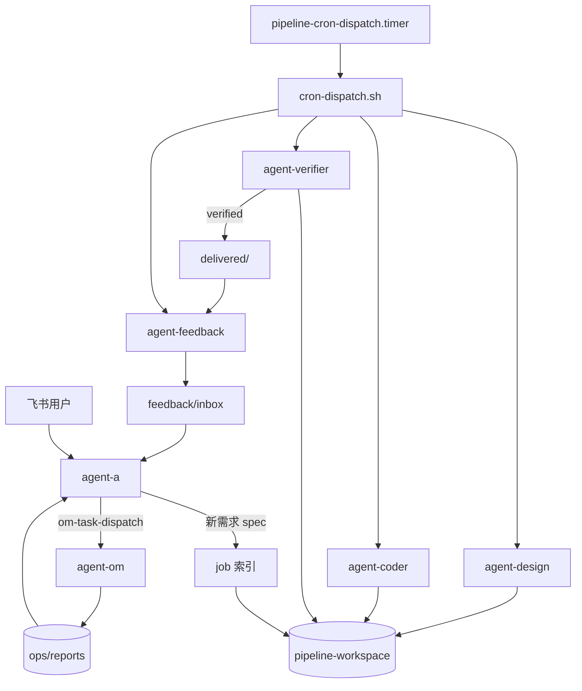
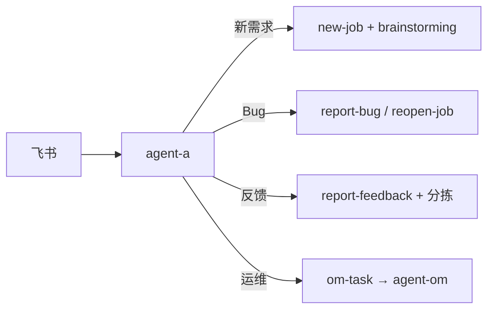
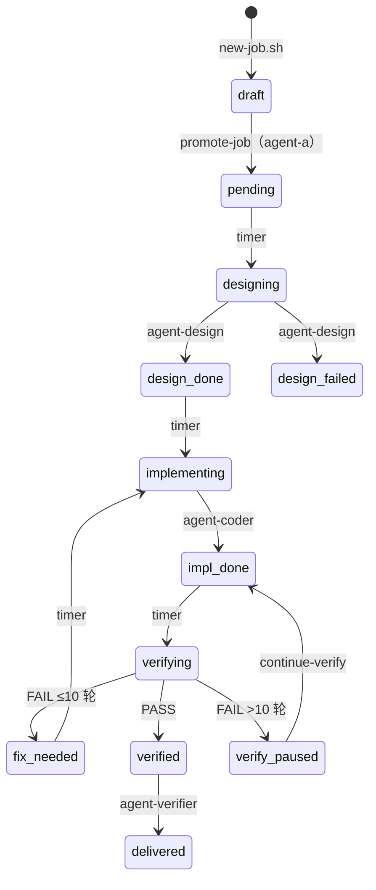
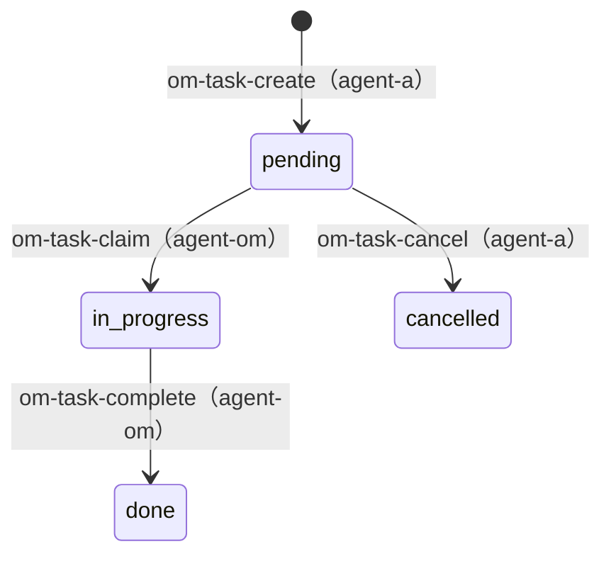
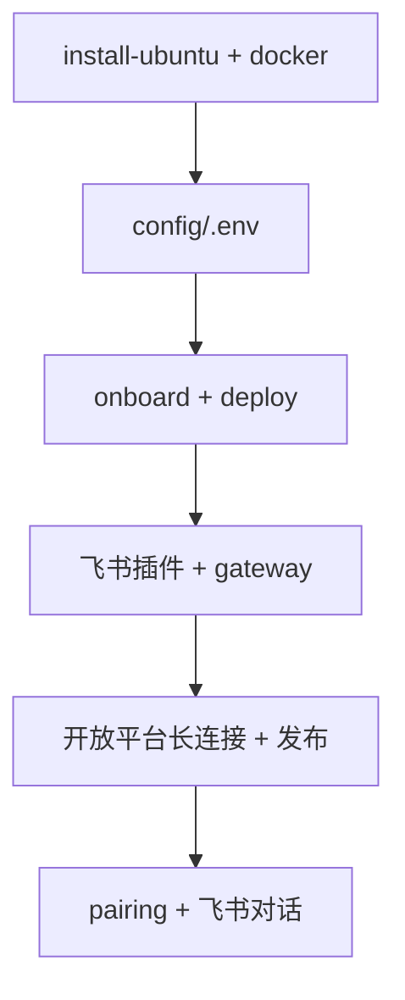

# OpenClaw 飞书多 Agent 流水线

基于 [OpenClaw](https://docs.openclaw.ai/)：飞书 → 需求 MD → Timer 驱动流水线（设计 / 实现 / 验证 / 反馈）；运维由 agent-a 直驱 agent-om。

> `docs/` 目录已移除；全部文档见本 README。

## 目录

- [核心规则](#核心规则)
- [架构与 Agent](#架构与-agent)
- [目录结构](#目录结构)
- [新需求 / Bug / 用户反馈](#新需求--bug--用户反馈)
- [状态机](#状态机)
- [Timer 调度](#timer-调度)
- [验证与 Docker](#验证与-docker)
- [运维 agent-om](#运维-agent-om)
- [Agent 职责边界](#agent-职责边界)
- [安全约定](#安全约定)
- [部署指南](#部署指南)
- [环境变量](#环境变量)
- [关键脚本](#关键脚本)
- [Cron 卡死重试](#cron-卡死重试)
- [运维排错](#运维排错)
- [验收检查表](#验收检查表)

---

## 核心规则

| # | 规则 |
|---|------|
| 1 | 每轮迭代验证最多 **10 次**；用尽 → `verify_paused` → 用户决定是否下一轮 |
| 2 | **agent-a** 对用户；运维 **直驱 agent-om**（不经 timer） |
| 3 | 本地验证用 **流水线部署机 IP**；生产在 `.env`；部署须用户指定 server |
| 4 | 所有 status 读写带 **容错**（`status-integrity.sh`） |
| 5 | **job status 仅 timer + 白名单脚本** 修改；OpenClaw 禁止手改 |
| 6 | Bug / 同需求修复 **不开新 job**；仅新需求 `new-job.sh` |
| 7 | 其他跳过流水线约定 **须飞书与用户确认**（`PIPELINE_USER_OVERRIDE=1`）；**status 不可手改** |
| 8 | **禁止 Agent 修改**编排仓库 `scripts/`、`workspaces/`、`config/`（只读 exec 调用脚本） |

---

## 架构与 Agent



| Agent | 职责 | 调度 |
|-------|------|------|
| **agent-a** | 飞书入口、需求沟通、查状态、Bug/反馈、直驱运维 | 飞书 + timer digest |
| **agent-om** | 部署/日志/诊断；运维 Bug → report-bug | **agent-a 直驱** |
| **agent-design** | Stitch → `design/` | timer |
| **agent-coder** | `src/` 实现 / Bug 修复 | timer |
| **agent-verifier** | Docker 验证 + 审查 + 交付 | timer |
| **agent-feedback** | 扫描 delivered/raw → inbox | timer |

---

## 目录结构

```
test-pipeline/                          编排仓库（scripts、config、workspaces）
pipeline/jobs/<job-id>/job.md           任务指针（仅此文件）

pipeline-workspace/<project>/           与 test-pipeline 平级（WORKSPACE_ROOT）
  jobs/<job-id>/                        进行中：spec、status.json、design、src、reports
  delivered/<job-id>/                   验证通过后复制
  feedback/                             raw / inbox / processed
  ops/                                  运维（与 delivered 平级）
    tasks/om-*.md
    reports/om-*.md
```

环境变量：`PIPELINE_ROOT`、`WORKSPACE_ROOT`（见 [config/env.example](config/env.example)）。

---

## 新需求 / Bug / 用户反馈

所有消息先到 **agent-a**。无法判断时一次一问：「新需求、Bug、反馈，还是运维？」



### 三者对比

| | **新需求** | **Bug** | **用户反馈** |
|---|-----------|---------|----------------|
| 典型说法 | 加功能、改版 | 坏了、不符合验收 | 建议、体验、抱怨 |
| 开新 job | **是** | **否** | **否**（分拣后可能转新需求） |
| 脚本 | `new-job.sh` → `promote-job.sh` | `report-bug.sh` / `reopen-job.sh` | `report-feedback.sh` |
| 落盘 | `spec.md` | `reports/bugs.md` | `reports/user-feedback.md` |
| 改 job status | draft → pending | → `fix_needed` | 通常不改 |
| 自动 coder | pending 后进流水线 | **是**（timer） | **否** |

### 新需求（唯一开 job）

1. agent-a 加载 `workspaces/agent-a/skills/brainstorming/SKILL.md`
2. `new-job.sh` → `status=draft`
3. 飞书多轮澄清 → 方案对比 → 写入 workspace **`spec.md`**（飞书文字不算交付物）
4. `validate-spec.sh` → 用户批准 → `promote-job.sh` → `pending`
5. timer：design → coder → verifier → `delivered/`

落盘六步：`new-job` → 读 `job.md` → 写 `spec.md` → `validate-spec` → `promote-job` → 回读确认。

### Bug 处理流程

**Bug 修复不新开 job**，在原 job 登记并回流 coder。

```bash
PIPELINE_AGENT=agent-a ./scripts/report-bug.sh <job-id> \
  --reason "复现步骤与期望行为" --by feishu-user
```

- 写入 `reports/bugs.md`，status → `fix_needed`
- timer：`fix_needed → implementing` → agent-coder 修复 → verifier 重验

| 来源 | 动作 |
|------|------|
| 用户飞书报 Bug | agent-a → `report-bug.sh` |
| 验证失败 | `complete-verify.sh` → `fix_needed` + `verify-feedback.md` |
| agent-om 发现代码缺陷 | `report-bug.sh --om-task <id>` |
| 交付后 inbox `bug_report` | agent-a → `reopen-job.sh` |

agent-coder 修复必读（优先级）：`bugs.md` → `verify-feedback.md` → `verify*.md` → `ops/reports/<om-task>.md`。

`draft` / `pending` 阶段缺陷：改 **spec.md**，不用 report-bug。

### 用户反馈流程

| | 用户反馈 | Bug |
|---|----------|-----|
| 含义 | 建议、抱怨、体验 | 可复现缺陷 |
| 脚本 | `report-feedback.sh` | `report-bug.sh` |
| 自动 coder | **否** | **是** |

```bash
PIPELINE_AGENT=agent-a ./scripts/report-feedback.sh <job-id> \
  --type suggestion --reason "用户希望..." --by feishu-user
```

agent-a 分拣：转 Bug / 转新需求 / 改 spec / 仅存档。

**inbox 闭环**（timer：`pipeline-feedback-scan` → agent-a digest）：

| inbox 类型 | 处理 |
|------------|------|
| `bug_report` | `reopen-job.sh`（不开新 job） |
| `feature_request` | 问用户是否新需求 → `new-job.sh` |
| `user_complaint` | 摘要；涉及缺陷则 reopen |
| 处理完 | 移至 `inbox/processed/` |

---

## 状态机

两套状态：**job 流水线**（timer）与 **ops 运维**（agent-a 直驱 agent-om）。

### Job 流水线（`jobs/<job-id>/status.json`）

**驱动**：`pipeline-cron-dispatch.timer` → `cron-dispatch.sh` → `job-transition.sh` + `pipeline-*-scan`



| status | 含义 | 触发方 | 执行 Agent |
|--------|------|--------|------------|
| `draft` | 需求分析中 | agent-a | agent-a（brainstorming） |
| `pending` | 已批准，待设计 | agent-a | — |
| `designing` | 设计中 | timer 入口 | agent-design |
| `design_done` | 设计完成 | agent-design | — |
| `implementing` | 实现/修复中 | timer 入口 | agent-coder |
| `impl_done` | 实现完成 | agent-coder | — |
| `verifying` | 验证中 | timer 入口 | agent-verifier |
| `verified` | 验证通过 | complete-verify | agent-verifier 交付 |
| `fix_needed` | 待修复 | report-bug / complete-verify | — |
| `verify_paused` | 本轮 10 次未过 | complete-verify | agent-a 通知用户 |

#### Timer Agent 与 job status

| Agent | Cron | 扫描条件 | 入口 status | 出口 status |
|-------|------|----------|-------------|-------------|
| agent-design | pipeline-design-scan | pending / designing 卡死 | pending→designing | design_done |
| agent-coder | pipeline-coder-scan | design_done / fix_needed / implementing 卡死 | →implementing | impl_done |
| agent-verifier | pipeline-verify-scan | impl_done / verifying 卡死 / verified 未交付 | impl_done→verifying | verified |
| agent-feedback | pipeline-feedback-scan | delivered / raw | — | 写 inbox |
| agent-a | pipeline-a-feedback-digest | inbox 未处理 | — | 归档 inbox |
| agent-a | pipeline-a-verify-notify | verify_paused 未通知 | — | 飞书问用户 |

**白名单改 job status**：`promote-job.sh`、`report-bug.sh`、`complete-verify.sh`、`continue-verify.sh`、`reopen-job.sh`、`job-transition.sh`。Agent **禁止**手 edit `status.json`。

### Ops 运维（`ops/tasks/*.md`）

**驱动**：agent-a → `om-task-create` → **`om-task-dispatch`** → agent-om



| status | 含义 | 谁写入 |
|--------|------|--------|
| `pending` | 已创建 | om-task-create.sh |
| `in_progress` | 执行中 | om-task-claim.sh |
| `done` | 完成，报告在 ops/reports/ | om-task-complete.sh |
| `cancelled` | 已取消 | om-task-cancel.sh |

| 对比 | job 流水线 | ops 运维 |
|------|------------|----------|
| 调度 | timer + cron-dispatch | agent-a 直驱 |
| 状态文件 | `status.json` | task md frontmatter |
| 目录 | `jobs/<job-id>/` | `ops/`（与 delivered 平级） |

---

## Timer 调度

**Job 流水线**由 timer 驱动；**agent-om 不经 timer**。

```
pipeline-cron-dispatch.timer（每分钟）
  → cron-dispatch.sh
      → job-transition.sh（job 入口 status）
      → openclaw cron run pipeline-*-scan

agent-a（飞书）
  → om-task-create.sh → om-task-dispatch.sh → agent-om
```

OpenClaw 内 **6 条** Cron **保持 `enabled: false`**（不含 agent-om）。`setup-cron.sh` 会移除遗留 `pipeline-om-scan`。

### 给 OpenClaw 的指令

1. **不要**手改 `status.json` 或 ops task frontmatter
2. **不要**用 timer 触发 agent-om
3. agent-a 运维：create 后必须 **dispatch**
4. 破例须飞书与用户确认

### 调试

```bash
VERBOSE=1 ./scripts/cron-dispatch.sh
VERBOSE=1 DRY_RUN=1 ./scripts/cron-dispatch.sh
./scripts/setup-cron.sh
systemctl --user status pipeline-cron-dispatch.timer
```

---

## 验证与 Docker

**禁止仅静态审查**。须 Docker 构建部署 + 探活 + 失败回流。

### 验证轮次（每轮 10 次）

| 轮次 | 行为 |
|------|------|
| 1–10 FAIL | `fix_needed` → coder 修复 → 再验证 |
| 第 10 次仍 FAIL | `verify_paused` → agent-a 飞书问用户 |
| 用户「继续验证」 | `continue-verify.sh`（verifyRound 归零，verifyIteration+1） |

`status.json`：`verifyRound`、`verifyIteration`、`maxVerifyRounds: 10`。

### 验证链

```bash
./scripts/verify-pipeline.sh <job-id>
./scripts/claude-pipeline.sh verify .../src "..."
# 自动 complete-verify.sh --full
```

| 结果 | status |
|------|--------|
| PASS | verified |
| FAIL（轮次内） | fix_needed |
| FAIL（10 次用尽） | verify_paused |

### 本地验证 / 生产部署

- 本地探活：`detect-pipeline-host-ip.sh` → `VERIFY_DEPLOY_HOST`（流水线部署机 IP）
- 生产：`config/.env` 中 `DEPLOY_SERVER_PROD_*`；agent-om deploy 须 `--server prod`

| 变量 | 说明 |
|------|------|
| `VERIFY_DEPLOY_HOST` | 探活主机（默认本机 IP） |
| `PIPELINE_HOST_IP` | 显式指定本机 IP |
| `DEPLOY_SERVER_PROD_*` | 生产 VPS |

### Docker 安装（验证必需）

```bash
./scripts/install-docker.sh
newgrp docker    # 或重新登录
docker info
```

`install-ubuntu.sh` 会调用 Docker 安装。验证前确认 `docker compose` 可用。

agent-coder 交付须含 `docker-compose.yml`、健康检查端点（如 `/api/health`）；Dockerfile 内建议国内源（apt 阿里云、pip 清华、npm npmmirror）。

---

## 运维 agent-om

**不经 timer**。agent-a 创建后直接 dispatch：

```bash
PIPELINE_AGENT=agent-a ./scripts/deploy-servers-list.sh   # deploy 前让用户选 server

PIPELINE_AGENT=agent-a ./scripts/om-task-create.sh <project> \
  --type deploy --server prod --title "..." --job-id <job-id> --body "..."

PIPELINE_AGENT=agent-a ./scripts/om-task-dispatch.sh <project> <task-id>
```

| | agent-a | agent-om |
|---|---------|----------|
| 对用户 | 飞书入口 | 不对用户 |
| 创建 / 唤起 | create + **dispatch** | 被唤起后 claim/execute |
| 读结果 | 读 ops/reports/ 摘要 | complete 写报告 |
| 取消 | om-task-cancel | — |

| server id | 说明 |
|-----------|------|
| `local` | 流水线本机 IP |
| `prod` | `DEPLOY_SERVER_PROD_*` |

agent-om 发现代码缺陷 → `report-bug.sh` → job `fix_needed` → **timer** 触发 coder。

---

## Agent 职责边界

OpenClaw 各 Agent **职责分工界限分明，禁止越界**。工具（read/write/edit/exec/cron/message）不受限，但**不得修改**编排仓库 `scripts/`、`workspaces/`、`config/`；**status 须经脚本**（见 § 核心规则 #5、#8）。

| Agent | 职责 | 禁止越界 |
|-------|------|----------|
| **agent-a** | 飞书入口；需求 brainstorming → spec；分流 Bug/反馈/运维；汇总报告 | 写 job `src/`、`design/`；手改 status；代跑 implement/verify/Stitch |
| **agent-om** | 部署/日志/诊断；运维 Bug → report-bug | 写 job `src/`、spec、design；飞书对用户；改 `scripts/`、`workspaces/` |
| **agent-design** | Stitch → job `design/` | 改 `src/`；claude-pipeline；改 `scripts/`、`workspaces/` |
| **agent-coder** | job `src/` 实现与修复 | verify；report-bug；改 `scripts/`、`workspaces/` |
| **agent-verifier** | 运行时验证 + 交付 | 改 job `src/`；改 `scripts/`、`workspaces/` |
| **agent-feedback** | delivered/raw → inbox | 改 status；new-job；飞书回复；改 `scripts/`、`workspaces/` |

`PIPELINE_USER_OVERRIDE=1` 时可与用户确认后跳过**非 status、非基础设施** 类约定；**不得**手改 `status.json`，**不得**改 `scripts/`、`workspaces/`。

---

## 安全约定

**全局禁止（所有 Agent）**

- **修改编排仓库** `scripts/`、`workspaces/`、`config/`、`README.md` 等（脚本只读 exec 调用）
- 泄露 `config/.env`、API Key、SSH 密钥
- 删库、关服、未授权 force push
- **手改 job `status.json` 或 ops task frontmatter**（须走脚本，见 § 核心规则 #5）

**运维报告**：摘要给用户时脱敏 token、密码、敏感内网 IP。

---

## 部署指南

### 环境要求

Ubuntu 22.04+、Node.js 22+、Docker + Compose、飞书自建应用、LLM API Key、Stitch API Key、Claude Code CLI。

### 快速开始

```bash
cd /home/wmx/workspace/test-pipeline
./scripts/install-ubuntu.sh
./scripts/install-docker.sh
newgrp docker
cp -n config/env.example config/.env && nano config/.env
openclaw onboard --install-daemon
./scripts/deploy.sh
./scripts/setup-feishu.sh
# Gateway 在线 → 飞书开放平台保存长连接并发布
openclaw pairing approve feishu <CODE>
./scripts/setup-cron.sh --install-timer
```

### 部署阶段



### Gateway 与飞书

```bash
openclaw plugins install @openclaw/feishu
openclaw gateway install && openclaw gateway start
openclaw gateway status    # Runtime: running, probe: ok
openclaw logs --follow       # 应有 WebSocket client started
```

**飞书开放平台**

1. 创建自建应用 → App ID / Secret → `config/.env`
2. 启用机器人；权限：`im:message`、`im:message:send_as_bot`、`im:chat`、`contact:user.base:readonly`
3. Gateway **running** 后 → 事件订阅 → **长连接** → 添加 `im.message.receive_v1` → 保存
4. 版本管理与发布 → 全量发布
5. 飞书私聊发「你好」→ `openclaw pairing approve feishu <CODE>`

| 现象 | 处理 |
|------|------|
| 保存长连接失败 | 先 `gateway restart`，核对 Secret |
| Feishu plugin not installed | `openclaw plugins install @openclaw/feishu` |
| 无回复 | 检查已发布、pairing、LLM Key |
| device token scope mismatch | 见 [env-troubleshoot.md](env-troubleshoot.md) §2.8.1 |

### LLM（OpenClaw 主模型）

**DeepSeek（默认）**

```bash
export ANTHROPIC_BASE_URL="https://api.deepseek.com/anthropic"
export ANTHROPIC_API_KEY="sk-..."
export OPENCLAW_DEFAULT_MODEL="deepseek/deepseek-v4-pro[1m]"
```

改后：`./scripts/deploy.sh && openclaw gateway restart`

验证：`openclaw infer model run --model deepseek/deepseek-v4-pro[1m] --prompt "好"`

### Google Stitch MCP（agent-design）

1. [stitch.withgoogle.com](https://stitch.withgoogle.com) → settings → Create key
2. `STITCH_API_KEY` 写入 `.env` → `deploy.sh` → `gateway restart`

### Claude Code CLI（agent-coder / agent-verifier）

与 OpenClaw `ANTHROPIC_*` **独立**，写入 `CLAUDE_CODE_*`：

```bash
export CLAUDE_CODE_API_KEY="..."
export CLAUDE_CODE_BASE_URL="https://api.deepseek.com/anthropic"
export CLAUDE_CODE_MODEL="deepseek-v4-pro[1m]"
export CLAUDE_CODE_SUBAGENT_MODEL="deepseek-v4-flash"
```

`deploy.sh` 同步到 Claude Code profile。流水线用 `claude-pipeline.sh`，勿混用 OpenClaw 的 Key。

### 命令速查

```bash
source ~/.bashrc && cd $PIPELINE_ROOT && source config/.env
./scripts/deploy.sh && openclaw gateway restart
openclaw pairing list feishu && openclaw pairing approve feishu <CODE>
VERBOSE=1 DRY_RUN=1 ./scripts/cron-dispatch.sh
./scripts/new-job.sh "标题" && ./scripts/validate-spec.sh <job-id> && ./scripts/promote-job.sh <job-id>
```

运行期排错见 [env-troubleshoot.md](env-troubleshoot.md)。

---

## 环境变量

见 [config/env.example](config/env.example)。最小集：

```bash
export PIPELINE_ROOT="/home/wmx/workspace/test-pipeline"
export WORKSPACE_ROOT="/home/wmx/workspace/pipeline-workspace"
export FEISHU_APP_ID="cli_xxx"
export FEISHU_APP_SECRET="xxx"
export ANTHROPIC_BASE_URL="https://api.deepseek.com/anthropic"
export ANTHROPIC_API_KEY="sk-..."
export OPENCLAW_DEFAULT_MODEL="deepseek/deepseek-v4-pro[1m]"
export STITCH_API_KEY="..."
export CLAUDE_CODE_API_KEY="..."
export CLAUDE_CODE_BASE_URL="https://api.deepseek.com/anthropic"
export CLAUDE_CODE_MODEL="deepseek-v4-pro[1m]"
# 生产部署（可选）
# export DEPLOY_SERVER_PROD_HOST=""
```

---

## 关键脚本

| 脚本 | 用途 |
|------|------|
| `new-job.sh` / `validate-spec.sh` / `promote-job.sh` | 新需求 |
| `report-bug.sh` / `reopen-job.sh` | Bug（原 job） |
| `report-feedback.sh` | 用户反馈 |
| `cron-dispatch.sh` | Timer 调度中枢 |
| `job-transition.sh` | 合法 job status 流转 |
| `complete-verify.sh` / `continue-verify.sh` | 验证 / 用户确认下一轮 |
| `verify-pipeline.sh` / `claude-pipeline.sh` | 运行时 + Claude 验证 |
| `om-task-create.sh` / `om-task-dispatch.sh` | 运维 create + 直驱 agent-om |
| `om-task-cancel.sh` / `om-task-list.sh` | 取消 / 列表 |
| `detect-pipeline-host-ip.sh` | 本地验证 IP |
| `deploy-servers-list.sh` | 部署前选 server |
| `job-status.sh` | 只读查 status |
| `setup-cron.sh --install-timer` | 注册 Cron + systemd timer |
| `deploy.sh` | 同步 .env → OpenClaw 配置 |

---

## Cron 卡死重试

`cron-dispatch.sh` 规则：上一阶段完成且当前未占用 → 正常触发；status 进行中但缺产物且 Agent 未跑 → 卡死重试。

| Cron | 正常条件 | 卡死条件 |
|------|----------|----------|
| pipeline-design-scan | pending 且无 designing | designing 且无 DESIGN.md |
| pipeline-coder-scan | design_done/fix_needed 且无 implementing | implementing 且无 implement-summary.md |
| pipeline-verify-scan | impl_done 且无 verifying | verifying 且无 verify.md；verified 未 delivered |
| pipeline-feedback-scan | delivered/raw 有内容 | 有源且 agent 未在跑 |
| pipeline-a-feedback-digest | inbox 有 md | inbox 有且 agent-a 未在跑 |
| pipeline-a-verify-notify | verify_paused 未通知 | 同上 |

---

## 运维排错

### 改 `.env` 后

```bash
./scripts/deploy.sh
openclaw gateway restart
# 或 systemctl --user restart openclaw-gateway.service
```

| 变更 | deploy | restart Gateway |
|------|:------:|:-----------------:|
| FEISHU_* / ANTHROPIC_* / STITCH_* | 是 | 是 |
| CLAUDE_CODE_* | 是 | 否 |

新增 Cron 定义时另跑 `./scripts/setup-cron.sh`。

### 常见问题

| 现象 | 处理 |
|------|------|
| 飞书无回复 | pairing、已发布、日志 `openclaw logs --follow` |
| Cron 不跑 | `VERBOSE=1 ./scripts/cron-dispatch.sh`；timer 状态 |
| 验证 FAIL 未触发 coder | 查 verify-runtime.md；`complete-verify.sh --full` |
| Docker 不可用 | `./scripts/install-docker.sh`；`newgrp docker` |
| Stitch 401 | 更新 STITCH_API_KEY + deploy |
| Claude Code 401 | 检查 CLAUDE_CODE_* + deploy |

详见 [env-troubleshoot.md](env-troubleshoot.md)。

---

## 验收检查表

| # | 检查项 | 命令 |
|---|--------|------|
| 1 | openclaw 可用 | `openclaw --version` |
| 2 | 配置存在 | `~/.openclaw/openclaw.json` |
| 3 | 飞书 OK | `openclaw status` |
| 4 | Gateway running | `openclaw gateway status` |
| 5 | WebSocket | 日志 `WebSocket client started` |
| 6 | 长连接已保存 | 开放平台事件订阅 |
| 7 | 应用已发布 | 版本管理 |
| 8 | pairing | `pairing approve` 成功 |
| 9 | Docker | `docker info` |
| 10 | timer | `systemctl --user status pipeline-cron-dispatch.timer` |
| 11 | 能对话 | 飞书收到 AI 回复 |

---

## 许可证

配置与脚本为项目交付物；OpenClaw、Claude Code、Stitch 遵循各自上游许可。
