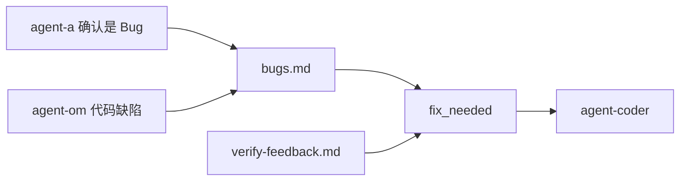

# Bug 回流

**Bug** = 可复现的缺陷、不符合验收标准的行为 → 需要 **agent-coder** 修代码。

| 项目 | Bug | 用户反馈（见 [FEEDBACK-FLOW.md](FEEDBACK-FLOW.md)） |
|------|-----|--------------------------------------------------|
| 落盘 | `reports/bugs.md` | `reports/user-feedback.md` |
| 触发修复 | `status` → `fix_needed` | **不**改 status |
| 处理方 | agent-coder | agent-a 分拣 |

## 谁可以提 Bug

| 来源 | Agent | 入口 |
|------|-------|------|
| 飞书用户（确认是缺陷） | agent-a | `report-bug.sh` `--by feishu-user` |
| 编排层 | agent-a | `report-bug.sh` `--by agent-a` |
| 运维发现代码问题 | agent-om | `report-bug.sh` `--by agent-om` → **coder 必须修** |
| 验证失败 | agent-verifier | 自动 `verify-feedback.md` |

用户只说「希望」「建议」「体验不好」但无明确缺陷 → **`report-feedback.sh`**，不要误用 report-bug。

**运维 Bug 与用户 Bug 对 coder 等价**：都进 `bugs.md` + `fix_needed`，agent-coder 不得忽略 `agent-om` 来源的条目。

## 流程



```bash
PIPELINE_AGENT=agent-a ./scripts/agent-a-run.sh report-bug.sh job-xxx \
  --reason "登录按钮无响应，复现步骤..." --by feishu-user

PIPELINE_AGENT=agent-om ./scripts/report-bug.sh job-xxx \
  --reason "API MissingGreenlet" --by agent-om --om-task om-xxx
```

`reopen-job.sh` = `report-bug.sh`（兼容旧名）。
