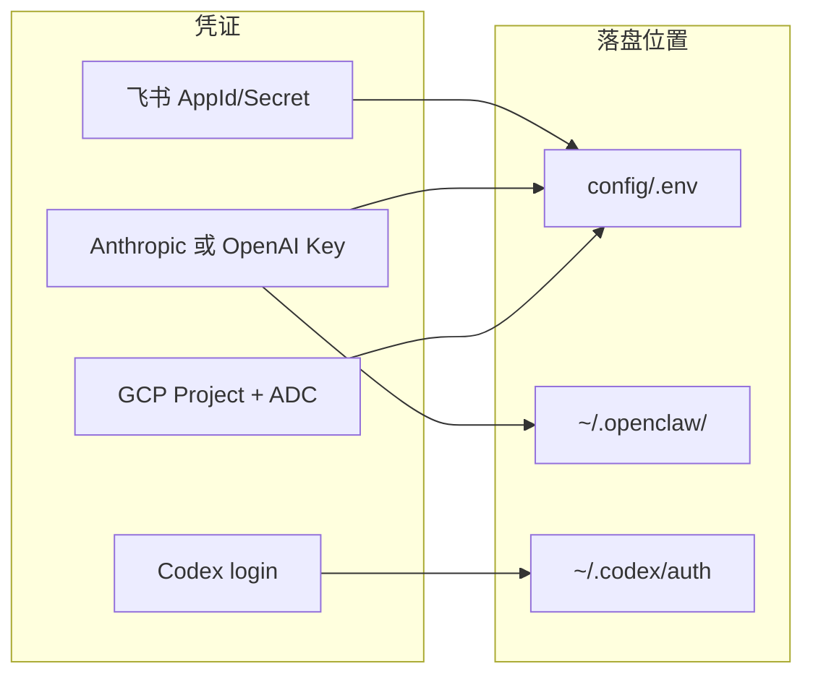

# 密钥与认证获取指南（Step by Step）

本指南对应 [config/env.example](../config/env.example) 中的变量，以及 [README.md](../README.md) 中的部署顺序。建议按 **1 → 5** 顺序完成，最后统一写入 `config/.env` 并执行 `./scripts/deploy.sh`。

> **安装与飞书连线操作清单**（命令顺序、Gateway、插件、配对）见 **[SETUP-FEISHU.md](SETUP-FEISHU.md)**。




---

## 1. 飞书：`FEISHU_APP_ID` / `FEISHU_APP_SECRET`

**用途**：飞书机器人收发消息（文字、图片、语音、文件）。

### 1.1 注册开放平台应用

1. 打开 [飞书开放平台](https://open.feishu.cn/app)（国际版用 [Lark Developer](https://open.larksuite.com/app)）。
2. 使用**企业管理员或有创建应用权限**的账号登录。
3. 点击 **创建企业自建应用** → 填写名称、描述 → 创建。

### 1.2 获取 App ID 与 App Secret

1. 进入应用 → 左侧 **凭证与基础信息**（或「应用凭证」）。
2. 复制：
  - **App ID**（形如 `cli_xxxxxxxx`）→ `FEISHU_APP_ID`
  - **App Secret** → `FEISHU_APP_SECRET`（仅显示一次时需立即保存；泄露后在同页重置）

### 1.3 开启机器人能力

1. 左侧 **应用能力** → **机器人** → 启用。
2. 设置机器人名称、头像（用户 @ 时显示）。

### 1.4 配置权限（Scope）

在 **权限管理** 中申请并开通（至少）：


| 权限                           | 说明              |
| ---------------------------- | --------------- |
| `im:message`                 | 收发消息            |
| `im:message:send_as_bot`     | 以机器人身份发消息       |
| `im:chat`                    | 获取群信息           |
| `contact:user.base:readonly` | 读取用户基础信息（解析发送者） |


按需增加：文件、图片、获取消息内容等（与你要用的消息类型一致）。

**在开放平台操作：**

1. 左侧 **开发配置** → **权限管理**（有的版本叫「安全设置」旁的「权限」）。
2. 搜索上表中的权限名 → 点击 **申请权限** → 等待管理员在企业管理后台 **通过**（自建应用有时自动通过）。
3. 权限状态变为 **已开通** 后再进行下面的 1.5。

---

### 1.5 之前：在本机准备好 OpenClaw（必做）

完成 1.1～1.4 后、去飞书保存「长连接」**之前**，先在 Ubuntu 上做完下面几步。否则飞书控制台会提示「没有检测到连接」而无法保存。

#### 步骤 A：确认命令可用

```bash
source ~/.bashrc
# 若仍找不到 openclaw：
source /home/wmx/workspace/test-pipeline/scripts/env.sh

openclaw --version    # 应输出版本号，例如 OpenClaw 2026.x.x
node -v             # 建议 v22.19+
```

若 `openclaw: command not found`，见 README「安装 npm 包」一节，或执行：

```bash
export PATH="$HOME/.local/node/bin:$HOME/.local/npm-global/bin:$PATH"
npm install -g openclaw@latest
```

#### 步骤 B：填写 `config/.env`

```bash
cd /home/wmx/workspace/test-pipeline
nano config/.env
```

至少填写（把 `cli_xxx` 换成你在 1.2 复制的值）：

```bash
export PIPELINE_ROOT="/home/wmx/workspace/test-pipeline"
export FEISHU_APP_ID="cli_xxxxxxxx"
export FEISHU_APP_SECRET="你的AppSecret"
```

LLM Key 可稍后再填，但 **飞书两项必须先有** 才能启动 Gateway 连飞书。

#### 步骤 C：首次初始化 OpenClaw（仅第一次）

```bash
cd /home/wmx/workspace/test-pipeline
source config/.env

openclaw onboard --install-daemon
```

向导中建议：

- 选 **本地 Gateway**
- 模型选你已准备好的 **Anthropic** 或 **OpenAI**（若尚未有 Key，可先跳过，但飞书连上后机器人还无法「思考」回复）
- 安装 **daemon**（开机/后台自启 Gateway）

#### 步骤 D：把本项目配置部署进 OpenClaw

```bash
cd /home/wmx/workspace/test-pipeline
./scripts/deploy.sh
```

成功后会生成/更新 `~/.openclaw/openclaw.json`，并把飞书 AppId/Secret 写进去。

#### 步骤 E：启动 Gateway（长连接靠它维持）

```bash
source ~/.bashrc
source /home/wmx/workspace/test-pipeline/config/.env

openclaw gateway restart
openclaw gateway status    # 应显示 running / 监听端口
```

另开一个终端**实时看日志**（先开着，再去飞书网页点保存）：

```bash
source ~/.bashrc
openclaw logs --follow
```

**期望看到的日志（大意即可，不必一字不差）：**

- `feishu` / `websocket` / `connected` 之类字样
- 没有持续的 `auth failed`、`invalid app secret`

若只有报错，先不要回飞书点保存，按本文末尾「飞书长连接保存失败」排查。

---

### 1.5 事件订阅（长连接）— 网页端详细步骤

> **含义**：飞书用「长连接」时，是你的服务器上的 OpenClaw **主动连飞书**，不是飞书访问你的 URL。所以必须先有 **步骤 1.5 之前** 里跑起来的 Gateway，飞书才允许保存配置。

#### 1.5.1 打开事件订阅页

1. 登录 [飞书开放平台](https://open.feishu.cn/app) → 进入你的应用。
2. 左侧菜单：**开发配置** → **事件订阅**（或 **事件与回调**）。

#### 1.5.2 选择「使用长连接接收事件」

1. 在 **订阅方式** 区域，选择 **使用长连接接收事件**（不要选「将事件发送至开发者服务器」除非你自己做了公网 Webhook）。
2. 此时先**不要点保存**（若页面有保存按钮）。

#### 1.5.3 确认 Gateway 已连接

回到服务器，确认：

```bash
openclaw gateway status
```

`openclaw logs --follow` 窗口无连续报错。然后再进行 1.5.4。

#### 1.5.4 添加事件

1. 在 **订阅事件** 列表中点击 **添加事件**。
2. 搜索并勾选：**接收消息** `im.message.receive_v1`。
3. （可选）若要用群聊：确认 1.4 里群相关权限已开通。

#### 1.5.5 保存配置

1. 点击页面底部 **保存** 或 **确定**。
2. **成功**：提示保存成功，长连接状态为「已连接」或类似绿色状态。
3. **失败**（常见文案：未建立连接、请先建立长连接）：
  - 回到服务器执行 `openclaw gateway restart`，等 10～30 秒
  - 再看 `openclaw logs --follow` 是否连上
  - 检查 `FEISHU_APP_ID` / `FEISHU_APP_SECRET` 是否与开放平台完全一致（无空格）
  - 再回网页点一次保存

#### 1.5.6 可选：用 CLI 写入飞书凭证

若 `deploy.sh` 未跑或想重新绑定：

```bash
source ~/.bashrc
openclaw channels login --channel feishu
```

- 选 **manual（手动）**，粘贴 App ID、App Secret。
- 完成后：`openclaw gateway restart`。

---

### 1.6 发布应用 — 详细步骤

未发布的应用，员工在飞书里**搜不到机器人**或无法正常使用。

#### 1.6.1 创建版本

1. 开放平台左侧：**应用发布** → **版本管理与发布**（名称可能略有不同）。
2. 点击 **创建版本**。
3. 填写版本号（如 `1.0.0`）、更新说明。
4. 确认本版本包含：机器人能力、已开通的权限、事件订阅（长连接 + `im.message.receive_v1`）。

#### 1.6.2 提交审核并发布

1. 点击 **保存并申请发布** / **提交审核**。
2. 企业自建应用：通常由 **租户管理员** 在 [飞书管理后台](https://www.feishu.cn/admin) → **工作台** → **应用管理** 里审批。
3. 审批通过后，回到开放平台该版本 → 点击 **发布** / **全量发布**。
4. 状态变为 **已发布** 或 **线上**。

#### 1.6.3 把机器人提供给使用者

1. 飞书客户端 → **工作台** → 找到你的应用；或
2. 在 **消息** 里搜索机器人名称 → 进入单聊；或
3. 在群里 **添加机器人**（群设置 → 群机器人 → 添加）。

---

### 1.7 本机配置与「配对」— 详细步骤

OpenClaw 默认 **不允许陌生人** 直接私聊机器人，需要先 **配对（pairing）**。

#### 1.7.1 再次确认 Gateway 在跑

```bash
source ~/.bashrc
openclaw gateway status
openclaw gateway restart   # 若未运行
```

#### 1.7.2 用飞书给机器人发第一条消息

1. 飞书 App 打开与机器人的 **单聊**。
2. 发送任意文字，例如：`你好`。
3. 机器人可能回复一个 **配对码**（或提示需要配对），此时它还不会正常对话。

#### 1.7.3 在服务器批准配对

```bash
source ~/.bashrc
openclaw pairing list feishu
```

输出示例（示意）：

```text
feishu  ABC123  ou_xxxxxxxx  pending
```

记下 **配对码**（如 `ABC123`），执行：

```bash
openclaw pairing approve feishu ABC123
```

将 `ABC123` 换成你列表里看到的码。

#### 1.7.4 再次在飞书发消息验证

1. 飞书再发：`你好`。
2. 若 LLM Key 与 `openclaw onboard` 已配置，Agent A 应开始回复。
3. 若无回复，执行：

```bash
openclaw logs --follow
```

同时检查 `config/.env` 里 `ANTHROPIC_API_KEY` 或 `OPENAI_API_KEY` 是否已填，并曾运行 `openclaw onboard`。

#### 1.7.5 群聊（可选）

默认需要 **@机器人** 才会回复。把机器人拉进群后，发：

```text
@你的机器人名 你好
```

若完全无反应：检查 1.6 已发布、群已添加机器人、开放平台 **可用范围** 包含该群成员。

---

### 1.8 飞书接入检查清单（打勾即用）


| 序号  | 检查项                             | 如何确认                           |
| --- | ------------------------------- | ------------------------------ |
| 1   | App ID/Secret 已写入 `config/.env` | `grep FEISHU config/.env`      |
| 2   | `./scripts/deploy.sh` 已执行       | 存在 `~/.openclaw/openclaw.json` |
| 3   | Gateway 运行中                     | `openclaw gateway status`      |
| 4   | 长连接已保存                          | 开放平台事件订阅页显示已连接                 |
| 5   | 应用已发布                           | 版本管理为「已发布」                     |
| 6   | 配对已通过                           | `pairing approve` 成功           |
| 7   | 能收到回复                           | 飞书私聊有 AI 回复（需 LLM Key）         |


---

### 1.9 飞书阶段常见错误


| 现象                            | 原因                     | 处理                                                        |
| ----------------------------- | ---------------------- | --------------------------------------------------------- |
| 保存长连接失败                       | Gateway 未启动或 Secret 错误 | 1.5 之前步骤 E；核对 Secret；`gateway restart`                    |
| `openclaw: command not found` | PATH 未加载               | `source ~/.bashrc` 或 `scripts/env.sh`                     |
| 搜不到机器人                        | 应用未发布或可见范围不含你          | 完成 1.6；管理后台检查应用可用范围                                       |
| 发了消息没反应                       | 未 pairing 或未 @         | 1.7.3 `pairing approve`；群聊要 @                             |
| 配对后仍不回复                       | 无 LLM API Key          | 完成本文第 2 节 + `openclaw onboard`                            |
| 日志 `app secret invalid`       | Secret 填错或已重置          | 开放平台重置 Secret，更新 `.env` 后 `deploy.sh` + `gateway restart` |


更细说明见 [FEISHU.md](FEISHU.md)、[OpenClaw 飞书文档](https://docs.openclaw.ai/channels/feishu)。

---

## 2. LLM：`ANTHROPIC_API_KEY` 或 `OPENAI_API_KEY`

**用途**：OpenClaw Gateway 主模型（Agent A 及 Cron Agent 推理）；`OPENAI_API_KEY` 还可用于飞书语音转写。

### 方案 A：Anthropic（与当前默认模型一致）

1. 注册 [Anthropic Console](https://console.anthropic.com/)。
2. 完成计费/额度设置（需绑定支付方式或申请额度）。
3. 进入 **API Keys** → **Create Key** → 复制（以 `sk-ant-` 开头）。
4. 写入 `config/.env`：

```bash
export ANTHROPIC_API_KEY="sk-ant-api03-..."
export OPENCLAW_DEFAULT_MODEL="anthropic/claude-sonnet-4-6"
```

1. 运行 `openclaw onboard`，在向导中选择 Anthropic 并粘贴 Key（会写入 `~/.openclaw/` 的 auth 配置）。

### 方案 B：OpenAI（主模型 + 语音转写二合一）

1. 登录 [OpenAI Platform](https://platform.openai.com/)。
2. **API keys** → **Create new secret key** → 复制（`sk-...`）。
3. 写入：

```bash
export OPENAI_API_KEY="sk-..."
# 若主模型也用 OpenAI，在 onboard 或 openclaw.json 中改 model
```

1. `openclaw onboard` 中选择 OpenAI provider。

### 语音转写（可选）

- 飞书语音消息需配置 `tools.media.audio`（见 OpenClaw 文档）。
- 通常复用 **同一个 `OPENAI_API_KEY`**（Whisper/转写接口）。
- 未配置时：Agent 可能只收到音频占位符，需用户补文字。

**注意**：不要把 Key 提交到 Git；`config/.env` 已在 [.gitignore](../.gitignore) 中忽略。

---

## 3. Google Stitch：`STITCH_API_KEY`（推荐，无需 gcloud）

**用途**：`agent-design` 通过 Stitch 远程 MCP 生成 UI 设计。

### 3.1 获取 API Key

1. 打开 [stitch.withgoogle.com](https://stitch.withgoogle.com) 并登录。
2. 右上角头像 → **Stitch settings** → **API key** → **Create key**。
3. 立即复制 Key（只显示一次），写入 `config/.env`：

```bash
export STITCH_API_KEY="AQ.xxxxx"
```

### 3.2 部署到 OpenClaw

```bash
cd /home/wmx/workspace/test-pipeline
source config/.env
./scripts/deploy.sh
openclaw gateway restart
```

OpenClaw 会连接官方端点 `https://stitch.googleapis.com/mcp`，请求头带 `X-Goog-Api-Key`。

### 3.3 验证

```bash
openclaw mcp show stitch
openclaw logs --follow   # 不应再出现 stitch Connection closed
```

### 3.4 与项目配置对齐

[config/openclaw.json5](../config/openclaw.json5) 中 `mcp.servers.stitch` 使用 HTTP transport；`deploy.sh` 从 `STITCH_API_KEY` 注入 header。

---

<details>
<summary>备选：gcloud ADC（旧方式，一般不需要）</summary>

若你更倾向 OAuth / GCP 项目，可安装 gcloud 并启用 `stitch.googleapis.com`，使用 `npx stitch-mcp` + `GOOGLE_CLOUD_PROJECT`。本项目默认已改为 API Key 方式。

</details>

---

## 4. Claude Code CLI：`CLAUDE_CODE_*`（agent-coder / agent-verifier）

**用途**：`agent-coder` / `agent-verifier` 通过 `scripts/claude-pipeline.sh` 调用 Claude Code 非交互模式（`claude --bare -p`）。

**与 OpenClaw 凭证隔离**：不得复用 `ANTHROPIC_API_KEY` / `ANTHROPIC_BASE_URL`；必须在 `config/.env` 中单独填写 `CLAUDE_CODE_*`。

### 4.1 确认已安装

```bash
source ~/.bashrc
claude --version
```

未安装时：`./scripts/install-ubuntu.sh` 或 `npm install -g @anthropic-ai/claude-code@latest`。

### 4.2 填写 `config/.env`

**DeepSeek（推荐，经 Claude Code Anthropic 兼容端点）**

在 `config/.env` 使用 `CLAUDE_CODE_*` 前缀；`deploy.sh` 会映射为 Claude Code 识别的环境变量名：

| `config/.env`（本项目） | 写入 `pipeline-settings.json` 的 `env` 键 | 说明 |
|-------------------------|-------------------------------------------|------|
| `CLAUDE_CODE_API_KEY` | `ANTHROPIC_AUTH_TOKEN`、`ANTHROPIC_API_KEY` | DeepSeek API Key |
| `CLAUDE_CODE_BASE_URL` | `ANTHROPIC_BASE_URL` | `https://api.deepseek.com/anthropic`（不带 `/v1`） |
| `CLAUDE_CODE_MODEL` | `ANTHROPIC_MODEL` | 主模型，如 `deepseek-v4-pro[1m]` |
| `CLAUDE_CODE_DEFAULT_OPUS_MODEL` | `ANTHROPIC_DEFAULT_OPUS_MODEL` | Opus 档，默认同 `CLAUDE_CODE_MODEL` |
| `CLAUDE_CODE_DEFAULT_SONNET_MODEL` | `ANTHROPIC_DEFAULT_SONNET_MODEL` | Sonnet 档，默认同 `CLAUDE_CODE_MODEL` |
| `CLAUDE_CODE_DEFAULT_HAIKU_MODEL` | `ANTHROPIC_DEFAULT_HAIKU_MODEL` | 轻量模型，如 `deepseek-v4-flash` |
| `CLAUDE_CODE_SUBAGENT_MODEL` | `CLAUDE_CODE_SUBAGENT_MODEL` | 子 Agent 模型，默认同 Haiku 档 |
| `CLAUDE_CODE_EFFORT_LEVEL` | `CLAUDE_CODE_EFFORT_LEVEL` | 推理力度，如 `max` |

示例（与 DeepSeek 官方 Claude Code 配置对应）：

```bash
export CLAUDE_CODE_API_KEY="sk-..."                              # → ANTHROPIC_AUTH_TOKEN
export CLAUDE_CODE_BASE_URL="https://api.deepseek.com/anthropic"
export CLAUDE_CODE_MODEL="deepseek-v4-pro[1m]"
export CLAUDE_CODE_DEFAULT_OPUS_MODEL="deepseek-v4-pro[1m]"
export CLAUDE_CODE_DEFAULT_SONNET_MODEL="deepseek-v4-pro[1m]"
export CLAUDE_CODE_DEFAULT_HAIKU_MODEL="deepseek-v4-flash"
export CLAUDE_CODE_SUBAGENT_MODEL="deepseek-v4-flash"
export CLAUDE_CODE_EFFORT_LEVEL="max"
```

**Anthropic 官方 API**（若不用 DeepSeek）：

```bash
export CLAUDE_CODE_API_KEY="sk-ant-..."
export CLAUDE_CODE_BASE_URL="https://api.anthropic.com"
export CLAUDE_CODE_MODEL="claude-sonnet-4-6"
export CLAUDE_CODE_DEFAULT_OPUS_MODEL="claude-opus-4-6"
export CLAUDE_CODE_DEFAULT_SONNET_MODEL="claude-sonnet-4-6"
export CLAUDE_CODE_DEFAULT_HAIKU_MODEL="claude-haiku-4-5-20251001"
export CLAUDE_CODE_SUBAGENT_MODEL="claude-haiku-4-5-20251001"
export CLAUDE_CODE_EFFORT_LEVEL="high"
```

未单独设置的 `*_OPUS_MODEL` / `*_SONNET_MODEL` 会回退到 `CLAUDE_CODE_MODEL`；`CLAUDE_CODE_SUBAGENT_MODEL` 默认回退到 `CLAUDE_CODE_DEFAULT_HAIKU_MODEL`。

### 4.3 部署与验证

```bash
./scripts/deploy.sh   # 生成 pipeline-settings.json 并同步到 ~/.claude/settings.json
claude --bare -p "只回复 hello"   # 或 claude（交互式，无需 --settings）
```

### 4.4 与流水线配置的关系

- 凭证写入 `config/.env` 的 `CLAUDE_CODE_*`，由 `deploy.sh` 渲染到 `~/.claude/pipeline-settings.json` 并同步 `~/.claude/settings.json`
- Agent 通过 `claude-pipeline.sh implement|verify|verify-fix` 调用，显式传 `--settings`

---

## 5. Codex CLI（可选）：`codex login`

**用途**：历史方案；当前流水线默认使用 Claude Code。若需 Codex，见下方步骤。

### 5.1 确认已安装

```bash
source ~/.bashrc   # 或 source scripts/env.sh
codex --version
```

### 5.2 方式一：ChatGPT 登录（推荐，含订阅额度）

```bash
codex login
```

1. 终端提示打开浏览器。
2. 使用 **ChatGPT 账号**（需有 Codex 可用权限的套餐，见 [OpenAI Codex 文档](https://developers.openai.com/codex)）。
3. 登录成功后凭证缓存在 `~/.codex/` 下（如 `auth.json`）。

**无图形界面服务器**：

```bash
codex login --device-auth
```

按提示在另一台设备打开 URL 输入设备码；需在 ChatGPT 账户设置中启用 Device Code 登录（工作区由管理员开启）。

### 5.3 方式二：API Key（CI/纯 API 计费）

1. 在 [OpenAI API Keys](https://platform.openai.com/api-keys) 创建 Key。
2. 登录：

```bash
printenv OPENAI_API_KEY | codex login --with-api-key
# 或
echo "sk-..." | codex login --with-api-key
```

API Key 计费与 ChatGPT 订阅**分开**；需账户有 Codex 可用模型权限。

### 5.4 验证

```bash
codex login status
codex exec -p ci "echo hello" -o /tmp/codex-test.md
```

### 5.5 与流水线配置的关系

- 登录信息：**不写入** `config/.env`（由 Codex 自己管理）。
- 沙箱与模型：[config/codex-profiles.toml](../config/codex-profiles.toml) 的 `[profiles.ci]` 在 `deploy.sh` 时合并到 `~/.codex/config.toml`。

---

## 6. 汇总：写入 `config/.env` 并部署

复制模板并填写：

```bash
cp config/env.example config/.env
nano config/.env
```

最小示例：

```bash
export PIPELINE_ROOT="/home/wmx/workspace/test-pipeline"
export FEISHU_APP_ID="cli_xxx"
export FEISHU_APP_SECRET="xxx"
export ANTHROPIC_API_KEY="sk-ant-..."
export OPENCLAW_DEFAULT_MODEL="anthropic/claude-sonnet-4-6"
export STITCH_API_KEY="your-stitch-api-key"
export CLAUDE_CODE_API_KEY="sk-..."
export CLAUDE_CODE_BASE_URL="https://api.deepseek.com/anthropic"
export CLAUDE_CODE_MODEL="deepseek-v4-pro[1m]"
export CLAUDE_CODE_DEFAULT_HAIKU_MODEL="deepseek-v4-flash"
export CLAUDE_CODE_SUBAGENT_MODEL="deepseek-v4-flash"
export CLAUDE_CODE_EFFORT_LEVEL="max"
# OPENAI_API_KEY 仅在使用 OpenAI 主模型或语音转写时需要
```

然后按顺序：

```bash
openclaw onboard --install-daemon    # 首次：配置 Gateway、模型、daemon
./scripts/deploy.sh
openclaw channels login --channel feishu
openclaw gateway restart
./scripts/setup-cron.sh
# codex login                          # 可选
```

---

## 7. 常见问题


| 问题                               | 处理                                                               |
| -------------------------------- | ---------------------------------------------------------------- |
| 飞书保存长连接失败                        | 先 `openclaw gateway restart`，确保 Gateway 在线后再在开放平台保存              |
| 机器人无回复                           | 检查应用已发布、`im.message.receive_v1` 已订阅、执行 `pairing approve`         |
| Stitch MCP 401/403               | 在 Stitch settings 重新 Create key，更新 `STITCH_API_KEY` 并 `./scripts/deploy.sh` |
| Claude Code 401/连接失败 | 检查 `CLAUDE_CODE_*` 已填、`CLAUDE_CODE_BASE_URL` 不带 `/v1`，并 `./scripts/deploy.sh` |
| `codex login` 浏览器打不开             | 使用 `codex login --device-auth` 或 API Key 管道登录（Codex 可选） |
| OpenClaw 与 Codex 都要 OpenAI Key 吗 | 可以：OpenClaw 用 Anthropic，Codex 单独 `codex login`；语音转写仍需 OpenAI Key |


---

## 相关文档

- [FEISHU.md](FEISHU.md) — 飞书接入清单
- [README.md](../README.md) — 系统架构与快速开始
- [config/env.example](../config/env.example) — 环境变量模板

