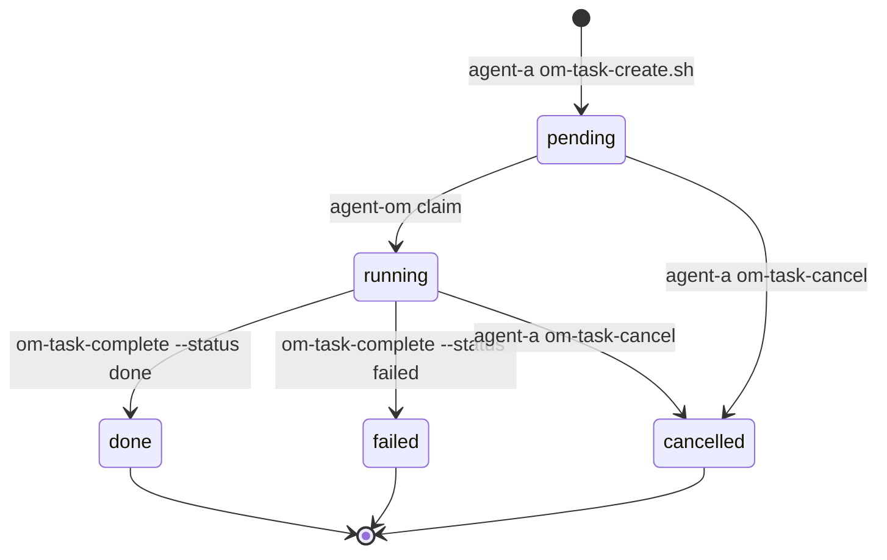

# 运维任务（agent-om）

**agent-om** 负责项目级系统运维（部署、日志收集、诊断等），由 **agent-a** 通过项目目录下的 Markdown 任务单下发，**不经过飞书长会话 exec**，保证 agent-a 飞书响应速度。

## 目录布局（按项目）

```
pipeline-workspace/<project>/
  ops/
    status.json       # 任务索引与状态机
    inbox/            # agent-a 下发（pending）
      om-20260607-120000.md
    running/          # agent-om 执行中
    reports/          # agent-om 反馈
      om-20260607-120000.md
    done/             # 已完成任务单归档
```

示例项目：`/home/wmx/workspace/pipeline-workspace/proj-20260530-103348/ops/`

## 状态机



| status | 位置 | 负责 Agent |
|--------|------|------------|
| `pending` | `ops/inbox/<id>.md` | 等待 agent-om |
| `running` | `ops/running/<id>.md` | agent-om 执行中 |
| `done` | `ops/done/<id>.md` + `ops/reports/<id>.md` | 已完成 |
| `failed` | `ops/done/<id>.md` + `ops/reports/<id>.md` | 失败（报告含原因） |
| `cancelled` | `ops/done/<id>.md` | agent-a 取消 |

## 任务类型（`type` 字段）

| type | 说明 | agent-om 典型动作 |
|------|------|-------------------|
| `deploy` | 部署/重启 | agent-a 先展示 **服务器列表**；任务单含 `serverId` / `sshTarget`；本机或 SSH 远程 `docker compose`、健康探活 |
| `logs` | 日志收集 | `docker logs`、`journalctl` |
| `diagnose` | 环境诊断 | `docker ps`、`ss`、读 reports |
| `custom` | 自定义 | 按任务单「步骤」执行 |

## agent-a（指挥方）

- **禁止**直接 `docker` / `systemctl` / `journalctl` / 长耗时 `exec`
- **必须**通过白名单网关：`agent-a-run.sh`
- 用户要**部署** → 先 `deploy-servers-list.sh` 展示列表 → 用户选定 `--server <id>` → `om-task-create.sh --type deploy`
- 用户要查日志/诊断 → `om-task-create.sh` → **立即飞书回复**「已下发运维任务 `om-xxx`」
- 查运维结果 → `om-task-list.sh` 或读 `ops/reports/<id>.md`

```bash
PIPELINE_AGENT=agent-a ./scripts/agent-a-run.sh deploy-servers-list.sh

PIPELINE_AGENT=agent-a ./scripts/agent-a-run.sh om-task-create.sh <project> \
  --type deploy --server prod --title "部署到生产" --job-id job-xxx \
  --body "rsync src 后 docker compose up -d 并探活"

PIPELINE_AGENT=agent-a ./scripts/agent-a-run.sh om-task-create.sh <project> \
  --type logs --title "收集 API 日志" --job-id job-xxx --body "最近 200 行"
PIPELINE_AGENT=agent-a ./scripts/agent-a-run.sh om-task-list.sh <project>
```

### 部署服务器清单

| 配置 | 内容 |
|------|------|
| `config/deploy-servers.json` | 服务器 id 列表；`local` 等静态项可写死 host |
| `config/.env` | **生产 VPS**：`DEPLOY_SERVER_PROD_HOST`、`DEPLOY_SERVER_PROD_SSH_USER`、`DEPLOY_SERVER_PROD_ROOT` |

| id | 说明 |
|----|------|
| `local` | 流水线宿主机本机 docker |
| `prod` | 远程生产机（IP 从 `.env` 读取；未配置则不出现在列表） |

## agent-om（执行方）

- Cron：`pipeline-om-scan`（dispatch 发现 `ops/inbox/*.md` 时触发）
- 认领：`om-task-claim.sh <project> <om-task-id>`
- 执行后：`om-task-complete.sh` 写 `ops/reports/<id>.md`

## 任务单 Markdown 模板

见 `pipeline/ops/_template/task.md`。

## Bug 升级（agent-om → coder）

运维任务执行中若发现 **代码/应用缺陷**（非单纯重启能解决的环境问题）：

1. 在 `ops/reports/<om-task-id>.md` 写清现象与日志
2. 对关联 job 调用 **`report-bug.sh`**（写入 `bugs.md` → `fix_needed`）
3. 再 `om-task-complete`；**agent-coder** 扫描 `fix_needed` 后读 `bugs.md`（含运维条目）及 `ops/reports/` 上下文并改 `src/`，agent-om **不改**业务代码

```bash
PIPELINE_AGENT=agent-om ./scripts/report-bug.sh <job-id> \
  --reason "..." --by agent-om --om-task <om-task-id>
```

用户 Bug 与 agent-a 登记见 [BUG-FLOW.md](BUG-FLOW.md)。
