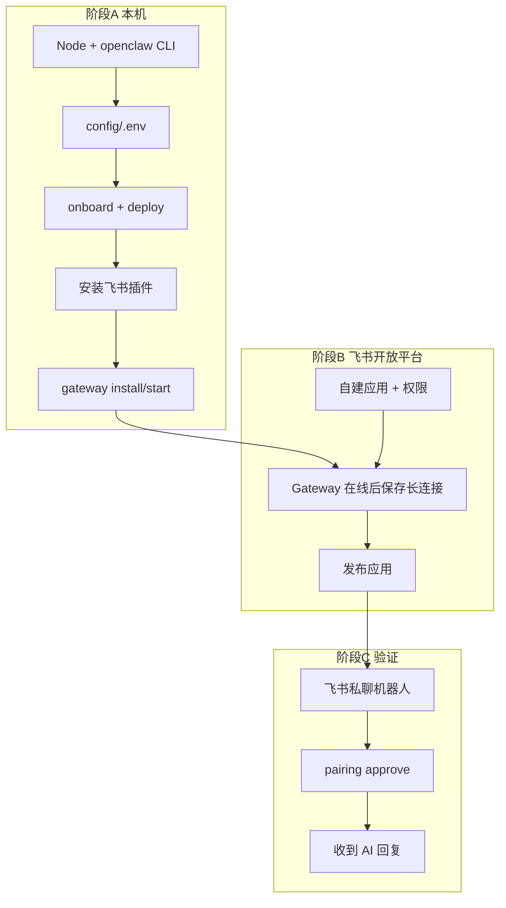

# OpenClaw 安装与飞书连接 — 完整流程

本文档把 **本机安装 OpenClaw** 与 **飞书长连接接入** 合成一条可照着做的清单。密钥如何申请见 [CREDENTIALS.md](CREDENTIALS.md)。



---

## 一、准备清单

| 准备项 | 说明 |
|--------|------|
| Ubuntu 22.04+ | 本项目部署机 |
| 飞书企业账号 | 能创建自建应用 |
| App ID / App Secret | 开放平台 → 凭证与基础信息 |
| LLM API Key | Anthropic 或 OpenAI（机器人要能回复必配） |
| 网络 | 服务器能访问飞书 API（出站 HTTPS/WSS） |

---

## 二、阶段 A：本机安装 OpenClaw

### A1. 安装 Node、OpenClaw、Claude Code（一键脚本）

```bash
cd /home/wmx/workspace/test-pipeline
./scripts/install-ubuntu.sh
```

或已装 Node 时手动：

```bash
export PATH="$HOME/.local/node/bin:$HOME/.local/npm-global/bin:$PATH"
npm install -g openclaw@latest @anthropic-ai/claude-code@latest
```

**加载 PATH（每个新终端都要，或已写入 `~/.bashrc`）：**

```bash
source ~/.bashrc
# 或
source /home/wmx/workspace/test-pipeline/scripts/env.sh

openclaw --version    # 应输出版本号，例如 OpenClaw 2026.5.22
```

若提示 `command not found`，见 [常见问题 Q1](#q1-openclaw-command-not-found)。

---

### A2. 填写 `config/.env`

```bash
cd /home/wmx/workspace/test-pipeline
cp -n config/env.example config/.env
nano config/.env
```

至少填写：

```bash
export PIPELINE_ROOT="/home/wmx/workspace/test-pipeline"
export FEISHU_APP_ID="cli_xxxxxxxx"
export FEISHU_APP_SECRET="你的AppSecret"
export ANTHROPIC_API_KEY="sk-ant-..."          # 或 OPENAI_API_KEY
export OPENCLAW_DEFAULT_MODEL="anthropic/claude-sonnet-4-6"
```

---

### A3. 首次初始化 OpenClaw（仅第一次）

```bash
source ~/.bashrc
cd /home/wmx/workspace/test-pipeline
source config/.env

openclaw onboard --install-daemon
```

向导建议：

- Gateway：**本地 (local)**
- 模型：选你已配置的 Anthropic / OpenAI
- 安装 **systemd 用户服务**（后台常驻 Gateway）

---

### A4. 部署本项目配置

```bash
cd /home/wmx/workspace/test-pipeline
./scripts/deploy.sh
```

作用：生成 `~/.openclaw/openclaw.json`，写入飞书 AppId/Secret、多 Agent、Stitch MCP 等。

检查：

```bash
test -f ~/.openclaw/openclaw.json && echo "配置文件 OK"
```

---

### A5. 安装飞书插件（必做，否则飞书不会连）

OpenClaw 2026.x 的飞书通道是**独立插件**，未安装时 `openclaw status` 会显示 `plugin not installed`。

```bash
source ~/.bashrc
openclaw plugins install @openclaw/feishu
```

或一键脚本（含 A4～A6）：

```bash
cd /home/wmx/workspace/test-pipeline
./scripts/setup-feishu.sh
```

---

### A6. 安装并启动 Gateway

```bash
source ~/.bashrc
openclaw gateway install    # 首次：安装 systemd 用户服务 + 生成 gateway token
openclaw gateway start      # 启动（或 restart）
openclaw gateway status     # Runtime: running, Connectivity probe: ok
```

**期望输出要点：**

- `Runtime: running`
- `Listening: 127.0.0.1:18789`
- `Connectivity probe: ok`

实时日志（保存飞书长连接前建议开着）：

```bash
journalctl --user -u openclaw-gateway.service -f
# 或
openclaw logs --follow
```

**期望出现（飞书相关）：**

```text
starting feishu[default] (mode: websocket)
WebSocket client started
```

确认通道状态：

```bash
openclaw status
```

Channels 表格中 **Feishu** 应为 `ON` + `OK`（不是 WARN / plugin not installed）。

---

## 三、阶段 B：飞书开放平台配置

在 **Gateway 已 running** 且 **Feishu 通道 OK** 后再做「保存长连接」。

### B1. 创建应用（若尚未完成）

1. 打开 https://open.feishu.cn/app
2. **创建企业自建应用** → 记录 **App ID**、**App Secret**
3. **应用能力** → **机器人** → 启用
4. **权限管理** → 申请并开通至少：
   - `im:message`
   - `im:message:send_as_bot`
   - `im:chat`
   - `contact:user.base:readonly`

### B2. 事件订阅 — 长连接（关键）

1. 确认本机：`openclaw gateway status` → **running**
2. 开放平台 → **开发配置** → **事件订阅**
3. 订阅方式选：**使用长连接接收事件**（不要只配 Webhook）
4. 添加事件：`im.message.receive_v1`
5. 点击 **保存**

| 保存结果 | 含义 |
|----------|------|
| 成功 | OpenClaw 已与飞书建立长连接，可进行 B3 |
| 失败「未建立连接」 | 回到 A6：`gateway restart`，看日志是否有 `WebSocket client started`，核对 App Secret |

### B3. 发布应用

1. **版本管理与发布** → 创建版本 → 提交审核 → **发布**
2. 未发布时，员工可能搜不到机器人或无法正常使用

### B4. 在飞书中找到机器人

- 工作台搜索应用名，或
- 消息里搜索机器人名称 → 进入单聊

---

## 四、阶段 C：配对与验证

默认 `dmPolicy: pairing`，陌生人需先配对。

### C1. 飞书给机器人发消息

发送：`你好`

### C2. 服务器批准配对

```bash
source ~/.bashrc
openclaw pairing list feishu
openclaw pairing approve feishu <配对码>
```

### C3. 再次发消息

若已配置 LLM API Key，Agent A 应回复。若无回复：

```bash
openclaw logs --follow
```

检查 `ANTHROPIC_API_KEY` / `onboard` 是否完成。

### C4. 群聊（可选）

拉机器人进群，发送：`@机器人名 你好`（默认需 @）

---

## 五、完整命令速查（复制执行）

```bash
# === 环境 ===
source ~/.bashrc
cd /home/wmx/workspace/test-pipeline
source config/.env

# === 安装（首次）===
./scripts/install-ubuntu.sh
openclaw onboard --install-daemon

# === 飞书通道（每次改 Secret 后）===
./scripts/deploy.sh
openclaw plugins install @openclaw/feishu
openclaw gateway restart

# === 检查 ===
openclaw gateway status
openclaw status
journalctl --user -u openclaw-gateway.service -n 50 --no-pager

# === 配对 ===
openclaw pairing list feishu
openclaw pairing approve feishu <CODE>
```

---

## 六、验收检查表

| # | 检查项 | 命令 / 位置 |
|---|--------|-------------|
| 1 | `openclaw` 可用 | `openclaw --version` |
| 2 | 配置文件存在 | `~/.openclaw/openclaw.json` |
| 3 | 飞书插件已装 | `openclaw status` → Feishu OK |
| 4 | Gateway 运行 | `openclaw gateway status` → running |
| 5 | WebSocket 已启 | 日志有 `WebSocket client started` |
| 6 | 开放平台长连接已保存 | 事件订阅页显示已连接 |
| 7 | 应用已发布 | 版本管理 → 已发布 |
| 8 | 配对已通过 | `pairing approve` 成功 |
| 9 | 能对话 | 飞书收到 AI 回复 |

---

## 七、常见问题

### Q1: `openclaw: command not found`

```bash
export PATH="$HOME/.local/node/bin:$HOME/.local/npm-global/bin:$PATH"
source ~/.bashrc
```

确认 `~/.bashrc` 末尾有：

```bash
export PATH="$HOME/.local/node/bin:$HOME/.local/npm-global/bin:$PATH"
```

---

### Q2: 日志里 `Gateway service disabled`

Gateway 未启动。执行：

```bash
openclaw gateway install
openclaw gateway start
openclaw gateway status
```

---

### Q3: `Local Gateway RPC unavailable`

同上，先 `gateway start`。`openclaw logs` 在 Gateway 未运行时会读 `/tmp/openclaw/*.log` 并提示 disabled。

---

### Q4: Feishu 显示 `plugin not installed`

```bash
openclaw plugins install @openclaw/feishu
openclaw gateway restart
openclaw status
```

---

### Q5: 飞书保存长连接失败

顺序必须是：**先** A6 Gateway + WebSocket 正常 → **再** B2 网页保存。

---

### Q6: `gateway token missing`（CLI 连 Gateway）

Gateway 启用了 token 认证。优先用：

```bash
journalctl --user -u openclaw-gateway.service -f
```

或确保使用较新的 `openclaw logs --follow`（会自动带本地 token）。

---

### Q7: `device token scope mismatch` / `EMBEDDED FALLBACK`

部署完成后跑 `openclaw agent --agent agent-a --message "回复 OK"` 时，若出现：

```text
device token scope mismatch (re-pair or approve scope upgrade)
EMBEDDED FALLBACK: Gateway agent failed; running embedded agent
```

说明本机 CLI 设备权限不足（常见：只有 `operator.read`，缺 `operator.write`）。Agent 可能仍通过 embedded 模式回复，但 **Gateway 链路未通**，飞书/Cron 等经 Gateway 的能力可能异常。

**处理**：按 [env-troubleshoot.md §2.8.1](../env-troubleshoot.md#281-device-token-scope-mismatch) 批准 scope 升级；或打开 **http://127.0.0.1:18789/** Control UI 批准。

---

## 八、相关文档

- [CREDENTIALS.md](CREDENTIALS.md) — 各密钥如何申请
- [FEISHU.md](FEISHU.md) — 飞书补充说明
- [env-troubleshoot.md](../env-troubleshoot.md) — `.env` 重启、LLM 连通、scope mismatch
- [README.md](../README.md) — 流水线架构与 Cron
